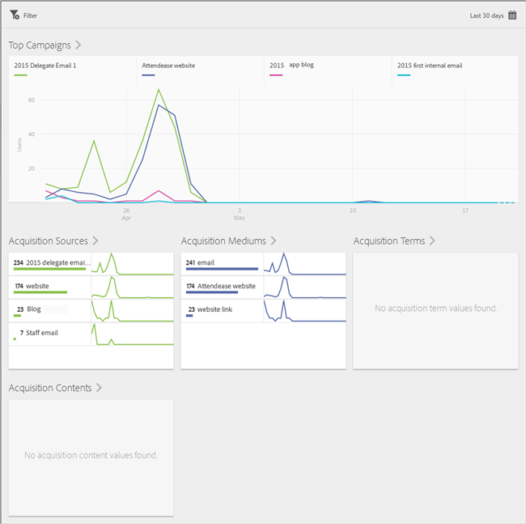
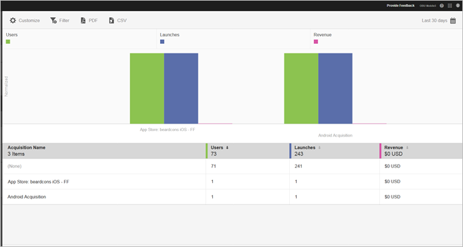

# Förvärv {#acquisition}

Marknadsförarna kan skapa spårningslänkar för att marknadsföra och locka trafik till sina appar. Dessa spårningslänkar kan leda användare till appbutiker, djupa applänkar och interstitialer, som kan korreleras med beteenden i appen. En marknadsförare kan skapa en länk för att dirigera användare till iOS, Android eller andra plattformar.

## Ny Adobe Experience Cloud SDK-version

Letar du efter information och dokumentation om Adobe Experience Platform Mobile SDK? Klicka [här](https://aep-sdks.gitbook.io/docs/) för att få den senaste dokumentationen.

Från om med september 2018 har vi släppt en ny större version av SDK. Dessa nya Adobe Experience Platform Mobile SDK:er kan konfigureras via [Experience Platform Launch](https://www.adobe.com/experience-platform/launch.html).

* Gå till [Launch](https://launch.adobe.com/)för att komma igång.
* Om du vill se vad som finns i Experience Platform SDK-databaserna går du till [Github: Adobe Experience Platform SDKs](https://github.com/Adobe-Marketing-Cloud/acp-sdks).

>[!IMPORTANT]
>
> Om du använder Adobe Experience Platform Mobile SDK:er med Adobe Launch **måste** du också installera Adobe Analytics Mobile Services-tillägget för att kunna använda Adobe Mobile Services-funktioner som förvärvslänkar. Mer information finns i [Adobe Analytics - Mobiltjänster](https://aep-sdks.gitbook.io/docs/using-mobile-extensions/adobe-analytics-mobile-services). Mer information om hur du använder förvärvs- och marknadsföringslänkar med SDK:er för Experience Cloud finns i [Inköp och marknadsföringslänkar](https://aep-sdks.gitbook.io/docs/using-mobile-extensions/adobe-analytics-mobile-services#acquisition-and-marketing-links).

>[!IMPORTANT]
>
>Även om du kan konfigurera funktioner i användargränssnittet fungerar dessa funktioner inte förrän du hämtar den genererade konfigurationsfilen och lägger till den i SDK:n. Mer information om hur du hämtar och konfigurerar SDK:er finns i *SDK-dokumentationen* på den här sidan.)

Ni kan skapa, redigera, hantera och visa rapporter om marknadsföringslänkar för spårbara mobilappar.

>[!TIP]
>
>Den här funktionen kräver Adobe Analytics - mobilappar eller Adobe Analytics Premium SKU.

Följande värvningsrapporter ger insikt i hur era marknadsföringslänkar fungerar:

* **Översikt** {#section_5B2BA47F22694919A472AB591101237E}

   Den här rapporten visar de främsta kampanjer som körde användarna till er app med information om hur kampanjer utfördes via andra spårningsmetadata som anskaffningskälla, medel, termin och innehåll.

   

* **Länkrapport** {#section_A23A640C363B43569D9D484CF49EA277}

   Den här rapporten ger en rankad bild av hur era marknadsföringslänkar fungerar. Förutom att visa länknamnen med nyckeltal går det även att anpassa rapporten. Mer information finns i [Anpassa rapporter](/help/using/usage/reports-customize/t-reports-customize.md).

   Kom ihåg följande information:

   * Du kan klicka på pilikonerna i kolumnrubrikerna för att sortera data i stigande eller fallande ordning.
   * Om du vill exportera data till ett PDF-dokument kan du klicka **[!UICONTROL Download]**.
   
