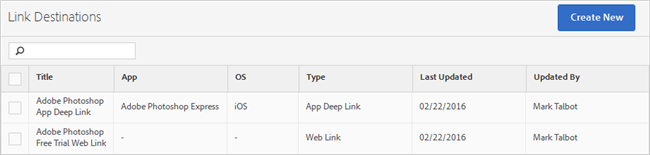

# Skapa och hantera länkmål{#create-and-manage-link-destinations}

På sidan Hantera länkmål kan du skapa, redigera, arkivera/ta bort länkmål. Dessa mål kan kallas textbundna när du skapar marknadsföringslänkar, push-meddelanden eller meddelanden i appen.

Så här visar du sidan Hantera länkmål:

1. Klicka på **[!UICONTROL Manage Apps]** på den vänstra navigeringsmenyn.
1. Klicka på appens namn för att visa dess app informationssida.
1. Klicka på **[!UICONTROL Manage Link Destinations]** längst upp till höger.

På sidan Länkdestinationer visas länkdestinationer och alternativ för att skapa, arkivera, arkivera, redigera och ta bort länkdestinationer.

Exempel:

