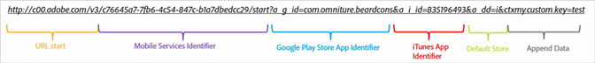
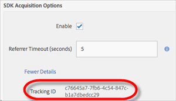

# Skapa förvärvslänkar manuellt {#create-acquisition-link-manually}

Du kan skapa marknadsföringslänkar för att få nya mobilappsanvändare direkt genom att konfigurera URL-parametrarna manuellt.

>[!IMPORTANT]
>
>Den här funktionen kräver SDK version 4.6 eller senare. Mer information finns i [Förutsättningar för anskaffning](/help/using/acquisition-main/c-acquisition-prerequisites.md).

I följande diagram visas komponenterna i en manuellt byggd spårningslänk och de olika URL-parametrar som du måste konfigurera när du skapar hämtningslänkar manuellt.

Den här länken är konfigurerad för att utföra en plattformsspecifik omdirigering till Google Play Store eller Apple App Store för en mobilapp. Om målet inte kan fastställas har standardarkivet angetts till Apple App Store. När appen har installerats kopplas den anpassade kontextnyckeln `my.custom.key:test` till installationsträdet för Analytics.

Om du vill skapa länkar manuellt använder du följande URL-format:

`http(s)://c00.adobe.com/v3/ {mobile-services-app-hash}/start? {parameters}`

>[!TIP]
>
>Den version av Android SDK du använder har ingen effekt på den här processen.

För iOS måste du använda rätt protokoll:

* Använd **HTTP** om du använder iOS SDK före version 4.7.0 eller om du använder iOS SDK 4.7.0 eller senare och om **[!UICONTROL Use HTTPS]** är **inte** inte är markerat på sidan Hantera programinställningar.
* Använd **HTTPS** om du använder iOS SDK 4.7.0 eller senare och **[!UICONTROL Use HTTPS]** **är** markerat på sidan Hantera programinställningar.

Om följande villkor är uppfyllda:

* `{mobile-services-app-hash}` matchar programmets identifierare i  `acquisition:appid ` konfigurationsfilen.

   Du hittar `{mobile-services-app-hash}` på sidan Hantera appinställningar under Alternativ för SDK-värvning i fältet Spårnings-ID.

   

* `{parameters}` är en lista med URL-frågeparametrar med särskilt namn.

Här är parameterlistan:

* **`a_g_id`**

   Appidentifierare för Google Play Store.

   * Exempelvärde: `com.adobe.beardcons`

* **`a_g_lo`**

   Google Play Store - Åsidosättning av språkområde.

   * Exempelvärde: `ko`

* **`a_i_id`**

   iTunes App Identifier.

   * Exempelvärde: `835196493`

* **`a_i_lo`**

   Åsidosättning av nationella inställningar för iTunes.

   * Exempelvärde: `jp`

* **`a_dd`**

   Standardarkiv för automatisk omdirigering.

   * Exempelvärde: `i | g`

* **`a_cid`**

   Åsidosättning av anpassat ID (vanligtvis IDFA för iOS eller ADID för Android).

   * Exempelvärde: `Any String < 255 characters (UTF-8 encoded)`

* **`ctx*`**

   Tangenter som har prefixet `ctx` finns i kontextdata för den resulterande startträffen.

   * Exempelvärde: `ctxmy.custom.key=myValue`

* **`ctxa.referrer.campaign.name`**

   Namn på anskaffningskampanj.

   Den här parametern krävs för rapportering om du vill jämföra prestanda för olika förvärvslänkar.

   * Exempelvärde: Summit 2015

* **`ctxa.referrer.campaign.trackingcode`**

   Spårningskod

   Den här parametern krävs för rapportering om du vill jämföra prestanda för olika förvärvslänkar.

   * Exempelvärde: `lexsxouj`

* **`ctxa.referrer.campaign.source`**

   Källan.

   * Exempelvärde: Annonsnätverk

* **`ctxa.referrer.campaign.medium`**

   Medel

   * Exempelvärde: E-post

* **`ctxa.referrer.campaign.content`**

   Innehåll

   * Exempelvärde: Bild nr 325689

* **`ctxa.referrer.campaign.term`**

   Term

   * Exempelvärde: vandrande+stövlar

Tänk på följande information när du skapar förvärvslänkar manuellt:

* Alla parametrar som inte matchar parametrar i tabellen skickas som en del av omdirigeringen i App Store.
* Alla parametrar är tekniskt valfria, men länken fungerar inte om minst ett lagrings-ID anges.

   Ett exempel på ett butiks-ID är `a_g_id`/ `a_i_id`.

* Om målarkivet inte kan bestämmas automatiskt och inget standardvärde anges returneras ett 404-fel.
