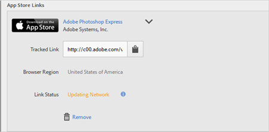

# Skapa en förvärvslänk{#create-an-acquisition-link}

Du kan skapa appbutikslänkar som gör att du kan hämta program direkt från Apple App Store och Google Play. Med de länkar du skapar kan du attribuera dina lyckade händelser till hämtningarna.

1. Klicka på **[!UICONTROL Acquisition]** > **[!UICONTROL Manage Acquisition Links]** > **[!UICONTROL Create New]**.
1. Skriv följande information i avsnittet **[!UICONTROL Link Information]**:

   * (**Obligatorisk**) **[!UICONTROL Name]**
Ange ett beskrivande namn för App Link.
   * **[!UICONTROL Tracking Code]**
Ange önskad spårningskod eller klicka  **[!UICONTROL Generate]** för att skapa en ny spårningskod.
   * (**Obligatorisk**) **[!UICONTROL Source]**
Ange den ursprungliga referenten, till exempel&quot;nyhetsbrev&quot; eller&quot;hemsida&quot;.
   * **[!UICONTROL Medium]**
Ange marknadsföringsmediet, till exempel&quot;banner&quot; eller&quot;email&quot;.
   * **[!UICONTROL Content]**
Ange namnet eller ID för annonsen med länken.
   * **[!UICONTROL Term]**
Ange betalda villkor eller andra sökvillkor för annonsen.
   >[!IMPORTANT]
   >
   >Värdena i fälten ovan kan inte ändras efter att förvärvningslänken har skapats.

1. Skriv information i fälten i avsnittet **[!UICONTROL Add App Store Link]**.

   * **[!UICONTROL App Store]**

      Välj en appbutik:
      * Apple App Store
      * Google Play

      Alternativen för respektive appbutik varierar enligt beskrivningen nedan.

   * **[!UICONTROL Browser Region (Apple App Store Only)]**

      Ange en särskild lokal appbutik för webbläsare på stationära datorer.

      Med den här inställningen kan du definiera den regionspecifika appbutik som du vill att en länk för förvärv ska dirigera till när en användare klickar på länken från en webbläsare på datorn. Automatisk omdirigering av mobila enheter baserat på enhetsinställningarna.

   * **[!UICONTROL Browser Language (Google Language (Google Play Only))]**

      Välj ett språk i listrutan.

      Med den här inställningen kan du definiera ett specifikt språk som ska visas i Google Play Store för webbläsare på datorer. Mobilenheter visar språk baserat på enhetsinställningar.

   * **[!UICONTROL Search by Name ]**

      * Om du inte känner till program-ID:t i Apple App Store kan du söka efter appen efter dess namn.

         Du kan begränsa sökningen genom att välja en valfri region i listrutan **[!UICONTROL In Region]**.

      * Om du inte känner till paketnamnet för Google Play kan du söka efter appnamnet med dess namn.
   * **[!UICONTROL App ID (Apple App Store only)]**

      Om du sökte efter programmet fylls det här fältet i automatiskt. Du kan skriva värdet för program-ID direkt i stället för att söka efter programmet.

   * **[!UICONTROL Package Name (Google Play only) ]**

      Om du sökte efter programmet fylls det här fältet i automatiskt. Istället för att söka. Du kan också skriva värdet för Paketnamn direkt.

1. Klicka på **[!UICONTROL Add]** > **[!UICONTROL Save]** om du vill spara konfigurationen och skapa länken.

   Den nyligen skapade länken visas i avsnittet **[!UICONTROL App Store Links]**.

   

1. Klicka på  för att kopiera den spårade länken till Urklipp.

1. Klistra in länken i dina inlägg i sociala medier, annonser, e-postmeddelanden och så vidare.
