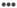

# Skapa eller redigera marknadsföringslänkar{#create-or-edit-marketing-links}

Du kan skapa eller redigera marknadsföringslänkar för att skapa en djup länk till din mobilapp eller webbplats. Mer information finns i [Apple Universal Links och Android App Links](/help/using/c-manage-app-settings/c-mob-confg-app/c-universal-app-links.md).

1. Expandera i det vänstra navigeringsfönstret i appen **[!UICONTROL Acquisition]** och klicka på **[!UICONTROL Marketing Link Builder]**.
1. Gör något av följande:

   * Om du vill skapa en marknadsföringslänk klickar du på **[!UICONTROL Create New]**.
   * Om du vill redigera en länk klickar du på länkens namn i **[!UICONTROL Title]** kolumnen.

1. Skriv information i följande fält:

   * **[!UICONTROL Marketing Link Name]**:

      (**Obligatoriskt**) Ange ett beskrivande namn för din Marketing Link. Namnet visas bara på sidan Marketing Links i användargränssnittet för Adobe Mobile Services. Ett beskrivande namn hjälper dig eller andra i organisationen att snabbt hitta en specifik länk och kan ge dig insikt i dess syfte.

   * **[!UICONTROL Unique Tracking Code]**:

      (**Obligatoriskt**) Ange önskad spårningskod eller klicka ( ) för att skapa en ny spårningskod. Du kan visa rapporter om hur spårningskoden används i detalj.

   * **[!UICONTROL Add Tracking Context Data]**:

      (**Valfritt**) Klicka på **[!UICONTROL +]** -ikonen och skriv relevant information för att spåra kampanjen med kontextdata. Välj en förinställd tagg eller någon av dina egna taggar i den **[!UICONTROL Custom Context Data]** nedrullningsbara listan. Kontextdata används för rapportering när Marketing Link distribueras.

      Följande förinställda taggar är tillgängliga:

      * **Anpassade kontextdata** Ange nyckel och värde. Om du lägger till anpassade kontextdata måste du skapa en bearbetningsregel. Mer information finns i Översikt över [regler för bearbetning](https://docs.adobe.com/content/help/en/analytics/admin/admin-tools/processing-rules/processing-rules.html).

      * **Källa** Ange den ursprungliga referenten, till exempel&quot;nyhetsbrev&quot; eller&quot;hemsida&quot;.

      * **Medel** Ange marknadsföringsmediet, till exempel&quot;banner&quot; eller&quot;email&quot;.

      * **Innehåll** Ange namn eller ID för annonsen med länken.

      * **Term** Ange betalda villkor eller andra sökvillkor för annonsen.
1. Klicka på **[!UICONTROL Save]**.
1. Skriv information i följande fält:

   * **(Obligatoriskt)** I **[!UICONTROL Fallback URL]** anger du den URL som användarna dirigeras till när ett mål inte kan matchas (t.ex. om användaren befinner sig på ett skrivbord eller en annan plattform som inte matchar en målregel).
   * I **[!UICONTROL Marketing Link Options]** väljer du **[!UICONTROL Interstitials]** eller **[!UICONTROL Universal and App Links]**.

      Mer information finns i [Interstitials](/help/using/acquisition-main/c-marketing-links-builder/t-create-edit-adobe-links/t-interstitials.md) eller [Apple Universal Links and Android App Links](/help/using/c-manage-app-settings/c-mob-confg-app/c-universal-app-links.md).

   * **(Villkorligt)** Om **[!UICONTROL Universal or App Links]** är markerat kan användare i **[!UICONTROL Custom Path]** definiera URL-sökvägen efter domänen med valfri frågeparameter. Mer information finns i [Apple Universal Links och Android App Links](/help/using/c-manage-app-settings/c-mob-confg-app/c-universal-app-links.md).

1. Klicka på **[!UICONTROL Edit Deep Link Interstitial]** och konfigurera länken.

   (**Valfritt**) Om det finns flera mål kan användare dirigeras beroende på om de har en mobilapp installerad eller inte. Om appen är installerad visas en interstitiell landningssida.

   Mer information finns i [Interstitialer](/help/using/acquisition-main/c-marketing-links-builder/t-create-edit-adobe-links/t-interstitials.md).

1. Klicka **[!UICONTROL Save]** och klicka **[!UICONTROL Next]**.
1. Konfigurera länken på sidan Mål.

   1. Klicka på **[!UICONTROL Decision]** ikonen () och välj en av följande beslutsplatser:

      * **[!UICONTROL Add Decision]**
      * **[!UICONTROL Add Path]**
   1. Om du valde **[!UICONTROL Add Decision]** någon av följande beslutstyper:

      * **[!UICONTROL Operating Decision]**

         Operativsystem som stöds är bland annat iOS, Android och AMX.

      * **[!UICONTROL Device Type]**

         Enhetstyper är enheter som stationära datorer, eReader, spelkonsoler, mobiltelefoner, digitalboxar med mera.
   1. Klicka på **[!UICONTROL Destination]** ikonen (  ) och välj någon av följande måltyper:

      * **[!UICONTROL App Store]**
      * **[!UICONTROL Web Link]**
      * **[!UICONTROL App Deep Link]**
      * **[!UICONTROL Hybrid Link]**

      >[!TIP]
      >
      >När du använder **[!UICONTROL Web Link]** måltypen med en länk till appbutiken spåras inte förvärvet. Använd måltypen om du vill spåra förvärv **[!UICONTROL App Store]** .

      Mer information finns i [Skapa ett nytt länkmål](/help/using/acquisition-main/c-manage-link-destinations/t-create-new-app-deep-link-destination.md).

1. Spara länken för marknadsföring genom att klicka på  och sedan **[!UICONTROL Save]**.
