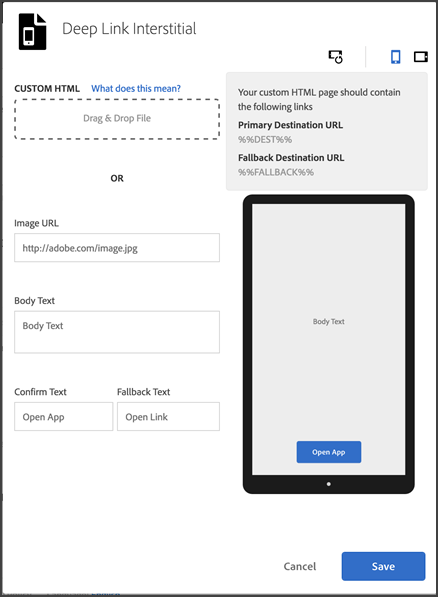

# Insticksannonser{#interstitials}

Du kan dirigera användare till ett mål beroende på om de har appen installerad (en applänk) eller inte (till en webbplats eller en appbutik). Användarna får bäst val av routning. Marknadsförarna kan erbjuda användaren valmöjligheter genom att konfigurera en interstitiell sida som visar vilka landningsdestinationer som är tillgängliga för användarna.

Så här konfigurerar du en interstititet när du skapar en marknadsföringslänk:

1. Klicka på **[!UICONTROL Edit Deep Link Interstitial]**.

   

1. Skriv information i följande fält:

   * **[!UICONTROL Custom HTML]**

      Välj en anpassad interstitiell HTML-sida.

      Genom att använda anpassade interstitialer kan marknadsförarna anpassa interstitiella landningssidor med anpassad HTML/CSS/JS, som gör att ni kan märka upp era sidor.

      Här är kraven för HTML-sidan:

      * Måste vara en HTML-fil.
      * Måste innehålla `%%DEST%%` platshållarna och `%%FALLBACK%%` .
      * Den överförda HTML-koden hanteras i en `<iframe>`.

         Du måste se till att länkmålen pekar på ett överordnat fönster. Du kan inkludera `<base target="_parent" />` i `<head>` eller ange en målegenskap för varje `<a/>` individuellt.

         >[!TIP]
         >
         >Om du överför egen HTML-kod kommer de andra fyra alternativen i tabellen inte att användas om du inte tar bort den överförda filen.
   * **[!UICONTROL Image URL]**

      Ange URL-adressen till en bildresurs.

   * **[!UICONTROL Body Text]**

      Ange brödtexten för interstitialen.

   * **[!UICONTROL Confirm Text]**

      Ange texten för textknappen.

   * **[!UICONTROL  Fallback Text]**

      Ange den reservtext som ska visas.

      Det här fältet uppdaterar textknappen om en djup länk misslyckas. Användarna uppmanas att prova den djupa länken innan de kan välja ett annat alternativ. En reservlösning kan till exempel vara till en appbutik för att hämta och installera appen eller ta användare till företagets webbplats. Med reservtexten kan användarna se att det finns ett annat alternativ om den djupa länken misslyckas.

1. (**Valfritt**) Klicka på ikonerna ovanför bilden för att se hur det interaktiva ser ut att rotera och på olika enheter.

   Du kan ändra eller redigera bilden utanför Mobiltjänster för att se till att bilden visas korrekt i olika situationer.
1. Klicka på **[!UICONTROL Save]**.
