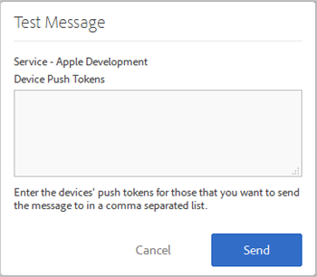

# Krav för att aktivera push-meddelanden {#prerequisites-to-enable-push-messaging}

Du måste slutföra de här åtgärderna innan du konfigurerar push-meddelanden i dina program.

## Aktivera Experience Cloud för ert företag

Ditt Adobe Analytics-företag måste vara Experience Cloud aktiverat. Du kan kontrollera status för din kontoansvarige på Adobe.

## Installera och konfigurera Mobile SDK

* **Installera Mobile SDK**

   Om du vill konfigurera push-meddelanden måste du hämta och installera minst version 4.6 eller senare av Mobile SDK. Mer information finns i [Hämta SDK:er](/help/using/c-manage-app-settings/c-mob-confg-app/t-config-analytics/download-sdk.md).

* **Konfigurera push-tjänster**

   Du måste konfigurera push-tjänster i Mobile SDK.
Mer information finns i följande innehåll:

   * [Push-meddelanden i Android](/help/android/messaging-main/push-messaging/push-messaging.md)
   * [Push Messaging i iOS](/help/ios/messaging-main/push-messaging/push-messaging.md)

## Logga in på tjänsten Mobile Core med ditt Adobe ID

>[!IMPORTANT]
>
>För att kunna använda Push Services-funktionen måste användarna logga in på Mobile Core-tjänsten med sitt Adobe ID och deras Analytics-konto måste vara länkat till deras Adobe ID:n. Push Services-funktionen är inte tillgänglig om användarna loggar in med sina befintliga Adobe Analytics-konton.

Om användarna inte har något Adobe-ID utför du följande steg:

1. (**Experience Cloud Administrator**) Bjud in användare till Experience Cloud.

1. (**Användare**) Skapa ett personligt Adobe-ID enligt instruktionerna från Experience Cloud-administratören.

   Ett e-postmeddelande skickas automatiskt till varje användare när administratören har slutfört det föregående steget.

1. (**Användare**) Logga in på Mobile med deras Adobe ID.

## Länka användarkonton i Experience Cloud

Varje användare måste länka Analytics-lösningskontot från Experience Cloud-organisationen.

1. Om du vill logga in på Experience Cloud med ett Adobe-ID skriver du [https://marketing.adobe.com](https://marketing.adobe.com) i en webbläsare.

1. Välj företagsnamnet för Analytics i det övre högra hörnet.

1. Klicka på **[!UICONTROL Lägg till organisation]** och välj **[!UICONTROL Adobe SiteCatalyst/Adobe Social]** i listrutan.

1. Ange företagsnamnet, dina tidigare autentiseringsuppgifter för det angivna företaget och klicka på **[!UICONTROL Länka konto]**.

   Adobe-id:t är nu länkat till ditt Analytics-konto, ditt företag och dina inloggningsuppgifter.

Mer information finns i [Felsökning av kontolänkning](https://docs.adobe.com/content/help/en/core-services/interface/manage-users-and-products/organizations.html).

## Konfigurera push-tjänster och SDK ID-tjänsten i mobilanvändargränssnittet

Innan du aktiverar ID-tjänsten för din app är **[!UICONTROL push-tjänsten]** inaktiverad. Men när du har aktiverat ID-tjänsten aktiveras push-tjänsten. Mer information om hur du aktiverar push-tjänster finns i [Konfigurera alternativ](/help/using/c-manage-app-settings/c-mob-confg-app/t-config-visitor.md)för SDK ID-tjänster.

>[!IMPORTANT]: Du måste klicka på **[!UICONTROL Spara]** för att spara ändringarna och uppdatera push-tjänsterna.
>
>Du kan konfigurera en app store-app för Apple och en för Google i varje rapportserie. Om du behöver ytterligare program, till exempel ett för en produktionsmiljö och ett för en utvecklingsmiljö, skapar du en ny app för appbutiken och en ny rapportsserie för varje miljö.

* För **Apple** drar och släpper du din privata nyckel och/eller ditt certifikat. Om din privata nyckel är lösenordskrypterad skriver du lösenordet.

   * För den **privata nyckeln** drar och släpper du filen med den privata nyckeln i rutan.

      Du kan också klicka på **[!UICONTROL Bläddra]** för att markera filen. Den här filen innehåller den privata nyckeln. Certifikatet kan också inkluderas i den här filen (`.p12`, `pkcs12`, `.pfx`, `.key`, `.pem`).

   * Om filen för den **privata nyckeln är krypterad skriver du lösenordet för det privata nyckellösenordet**.

      (Villkorligt) För **certifikatet** drar och släpper du certifikatfilen i rutan. Du kan också klicka på **[!UICONTROL Bläddra]** för att markera filen. Det här fältet är inte obligatoriskt om filen för den privata nyckeln även innehåller certifikatet ( `.cert`, `.cer`, `.crt`, `.pem`).

* För **Google** anger du API-nyckeln för programmet.

   Klicka på **[!UICONTROL Testa]** för att verifiera att appen och mobiltjänsterna är korrekt konfigurerade. Det här alternativet är användbart för felsökning och felsökning.

   Skriv enhetens push-token som du vill skicka meddelandet. Du kan skicka meddelandet till flera enheter genom att ange variabler i en kommaseparerad lista.

   
