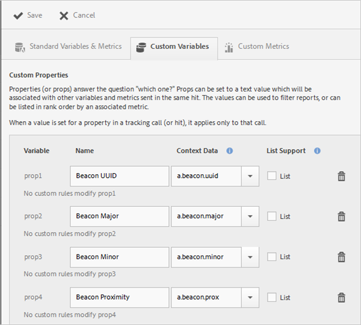
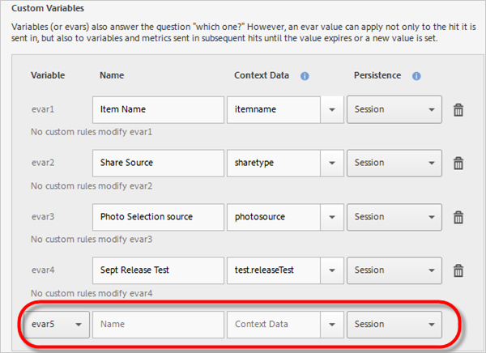

# Hantera din app {#managing-your-app}

Ni kan spåra och hantera data som ni får från appen genom att konfigurera olika variabler och mätvärden.

## Hantera variabler och mätvärden {#section_EC2D58AC334F4ED49E764B81C2423A62}

* **Standardvariabler och -mått**

   Varje program innehåller variabler och mätvärden för att spåra kundvagn och inköpsaktiviteter. Viss inköpsinformation kan inte hanteras med bearbetningsregler, så SDK visar speciella `"&&products"` kontextdata. Du kan till exempel ha variabler som varukorgstillägg, varukorgsborttagningar, utcheckningar, order och så vidare. Kontextdata måste mappas till data i Adobe Analytics. Om variabeln är ifylld med en enkel mappning från kontextdata är det här nyckeln som mappas till den. Lämna det tomt om variabeln fylls i med mer komplexa regler i Administrationsverktyg för analyser.

   Mer information om dessa variabler och mätvärden finns i:

   * [Produktvariabler i Android](/help/android/analytics-main/products/products.md)
   * [Produktvariabler i iOS](/help/ios/analytics-main/products/products.md)

* **Anpassade variabler**

   På sidan Anpassade variabler visas alla anpassade Analytics-variabler som har konfigurerats för den rapportserie som innehåller dina appdata. På den här sidan kan du aktivera ytterligare variabler och mappa kontextdata till Analytics-variabler.

### Mappa kontextdata till analysvariabler

Klicka på **[!UICONTROL Manage App Settings]** > **[!UICONTROL Manage Variables & Metrics]** > **[!UICONTROL Custom Variables]**.

Dessa mappningar anropar samma API som används i [bearbetningsregler](https://docs.adobe.com/content/help/en/analytics/admin/admin-tools/processing-rules/processing-rules.html).

Här är en lista med anpassade variabler som du kan konfigurera:

* Svaret **[!UICONTROL Custom Properties]** (eller svaren) på frågan&quot;vem?&quot; Props kan anges till ett textvärde som associeras med andra variabler och mätvärden som skickas i samma träff. Värdena kan användas för att filtrera rapporter eller kan listas i rangordning efter ett associerat mått.

   När ett värde anges för en egenskap i ett spårningsanrop (eller träff) gäller det bara det anropet.

* Svaret **[!UICONTROL Custom Variables]** (eller evar) besvarar även frågan&quot;vilken?&quot; Ett var-värde kan dock inte bara användas för den träff det skickas in, utan även för variabler och mätvärden som skickas i efterföljande träffar tills värdet förfaller eller ett nytt värde anges.
* Variablerna fungerar **[!UICONTROL Custom List Variables (or Multi-Value Variables)]** på samma sätt, förutom att du kan samla in flera värden i en träff. Mer information finns i [Lista variabler](https://docs.adobe.com/content/help/en/analytics/implementation/javascript-implementation/variables-analytics-reporting/page-variables.html).

Följande mappningar visas i Analytics som om de skapats i Mobile Services.

* **[!UICONTROL Name]**

   Datainsamlingsvariabelns egna namn.

* **[!UICONTROL Context Data]**

   Om variabeln är ifylld med en enkel mappning från kontextdata är det här nyckeln som mappas till den. Lämna det här fältet tomt om variabeln fylls i med mer komplexa regler i Administrationsverktyg för analyser.

   Klicka i kontextdatakolumnen och markera den kontextdatavariabel som du vill mappa. Listrutan innehåller variabler som tagits emot under de senaste 30 dagarna, så om de kontextdata du vill mappa inte finns med i listan kan du skriva in dem.

* **[!UICONTROL Persistence (Custom Variables and Custom List Variables)]**

   Med Persistence anger du den punkt där ett värde för en anpassad variabel (eVar) upphör att gälla eller inte längre kopplas till ytterligare träffar. Om en eVar har gått ut när en träff utlöses, kommer värdet None att associeras med den träffen för den eVar-händelsen. Det innebär att inget eVar-värde var aktivt när träffen utlöstes.

   Du kan välja något av följande alternativ:

   * **[!UICONTROL Session]**

      eVar-värdet kvarstår under hela Analytics-besöket.

   * **[!UICONTROL Tracking Call]**

      eVar-värdet kvarstår bara för det spårningsanrop eller träff på det som det ingick i.

   * **[!UICONTROL Never Expire]**

      eVar-värdet kvarstår för alla efterföljande spårningsanrop.
   * **[!UICONTROL Advanced]**

      Adobe Analytics har ett mer avancerat användargränssnitt för att ange beständighet för eVars. Om ett beständigt värde anges för eVar som inte stöds i Mobile Services visas det här värdet i gränssnittet för Mobile Services.

      Om du vill hantera eVars klickar du **[!UICONTROL Adobe Analytics Report Suite Manager]** > **[!UICONTROL Conversion Variables UI]**.

   * **[!UICONTROL List Support]**

      Gör det möjligt att skicka flera värden som ska associeras med egenskapen i ett spårningsanrop. Avgränsaren måste vara ett tecken och får inte vara noll eller ett blanksteg.

   * **[!UICONTROL Delimiter]**

      Avgränsaren måste vara ett tecken och får inte vara noll eller ett blanksteg.

### Ytterligare analysvariabler

Du kan aktivera ytterligare variabler med hjälp av listrutan längst ned i varje variabelavsnitt.

Välj ett oanvänt variabelnummer och skriv ett namn. Du kan också ange den kontextdatavariabel som du vill lagra och eventuell ytterligare information.

* **Anpassade mått**

   Mätvärden (eller händelser) besvarar frågorna *hur mycket?* eller *hur många?*. Händelser kan stegvis ökas varje gång användaren utför en åtgärd eller håller kvar numeriska värden, t.ex. ett pris. Anpassade mätvärden inkluderar händelser som när en app skapades, PDF- eller CSV-filen hämtades eller exporterades, en kampanj sparades, SDK hämtades, en rapport kördes, en länk till App Store lades till, ett meddelande i appen aktiverades och så vidare.

   Välj någon av följande anpassade måtttyper:

   * **[!UICONTROL Whole number]**
   * **[!UICONTROL Decimal number]**
   * **[!UICONTROL Currency]**

## Hantera intressepunkter {#section_990EF15E4E3B42CC807FCD9BEC8DB4C6}

Intressepunkter gör att du kan definiera geografiska platser som du kan använda för korrelationssyften, rikta dig mot meddelanden i appen och så vidare. När en träff skickas i en intressepunkt kopplas den till träffen. Mer information om intressepunkter finns i [Hantera intressepunkter](/help/using/location/t-manage-points.md).

## Hantera länkmål {#section_F722A387E22A430187B063D358A87711}

Du kan skapa, redigera, arkivera/ta bort länkmål. Dessa destinationer kan sedan anropas textbundna när du skapar marknadsföringslänkar, push-meddelanden eller meddelanden i appen. Mer information om länkmål finns i [Hantera länkmål](/help/using/acquisition-main/c-manage-link-destinations/t-archive-unarchive-link-destinations.md).

## Hantera återanslående {#section_78B0A8D7AE6940E78D85AE3AB829E860}

Tack vare återkopplingar kan du skicka data som samlats in av Adobe Mobile till en separat tredjepartsserver. Genom att utnyttja samma utlösare och egenskaper som du använder för att visa ett meddelande i appen kan du konfigurera Mobile för att skicka anpassade data till en tredjepartsdestination. Mer information om återanslående finns i [Konfigurera återanslående](/help/using/c-manage-app-settings/c-mob-confg-app/signals.md).
