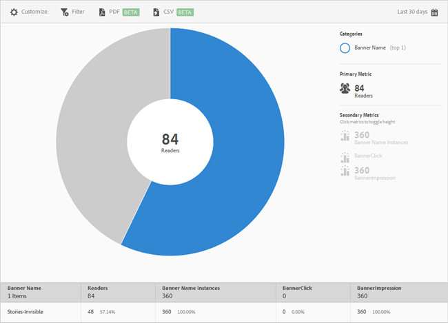

# Banderollmått {#banner-metrics}

I **[!UICONTROL Banner Metrics]** rapporten visas en solbränsvisualisering för dina befintliga data. Den här rapporten är endast tillgänglig för Digital Publishing Suite-kunder (DPS).

Som standard visas följande mått i den här rapporten:

* **[!UICONTROL Banner Name]**, vilket är namnet på banderollen.
* **[!UICONTROL Readers]**, vilket är antalet appanvändare.
* **[!UICONTROL Banner Name Instances]**, vilket är det antal gånger som banderollen har refererats genom klickningar och visningar.
* **[!UICONTROL Banner Click]**, vilket är antalet gånger som användare klickade på banderollen.
* **[!UICONTROL Banner Impressions]**, vilket är antalet gånger en banderoll visades (eller var synlig) på en webbläsarsida.

Den här rapporten liknar **[!UICONTROL Technology]** rapporten. För information om navigering och användning av solbränsrapporter. lägga till indelningar och mätvärden, skapa målaktiviteter, skapa klisterfilter och dela rapporter, se [Teknik](/help/using/usage/reports-technology.md). Informationen i det här avsnittet kan användas för att anpassa **[!UICONTROL Banner Metrics]** rapporten.
