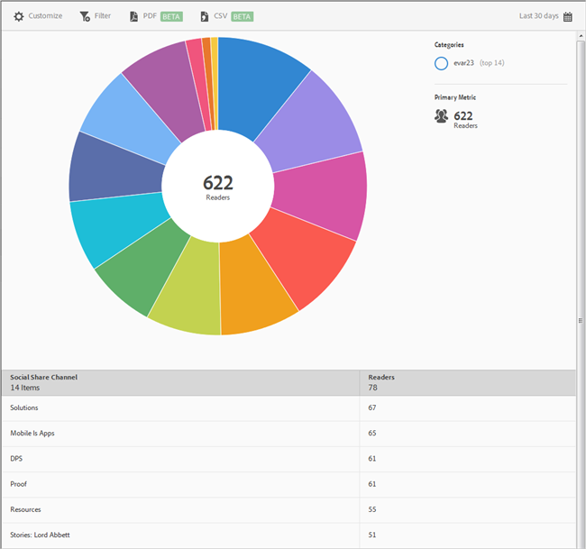

# Delning via sociala medier{#social-sharing}

Rapporten **[!UICONTROL Social Sharing]** visar en solbränsvisualisering för dina befintliga data. Den här rapporten är endast tillgänglig för DPS-kunder.

Som standard visar den här rapporten antalet läsare som delar artiklar i olika kanaler, som e-post, meddelanden och så vidare.

Den här rapporten liknar **[!UICONTROL Technology]**-rapporten. För information om navigering och användning av solbränsrapporter. lägga till indelningar och mätvärden, skapa målaktiviteter, skapa klisterfilter och dela rapporter, se [Teknik](/help/using/usage/reports-technology.md). Informationen i avsnittet Teknik kan användas för att anpassa **[!UICONTROL Social Sharing]**-rapporten.
