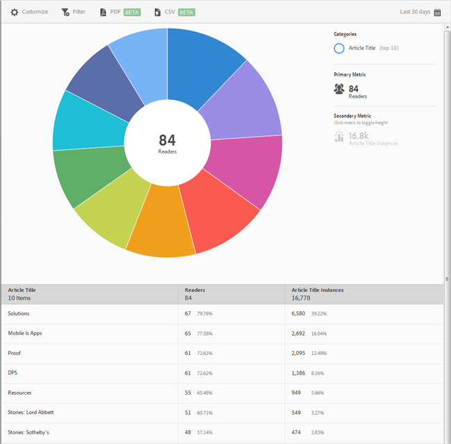

# Top 10 Articles report{#top-articles}

Rapporten **[!UICONTROL Top 10 Articles]** visar en solbränsvisualisering för dina data. Den här rapporten är endast tillgänglig för DPS-kunder.

Som standard visar den här rapporten artikeltiteln, antalet läsare, procentandelen av det totala antalet läsare samt artikeltitelinstanserna och procentandelen.

Den här rapporten liknar **[!UICONTROL Technology]**-rapporten. Mer information om hur du navigerar och använder solbränningsrapporter, lägger till uppdelningar och mätvärden, skapar målaktiviteter, skapar klibbiga filter och delar rapporter finns i [Teknik](/help/using/usage/reports-technology.md). Den här informationen kan användas för att anpassa **[!UICONTROL Top 10 Articles]**-rapporten.
