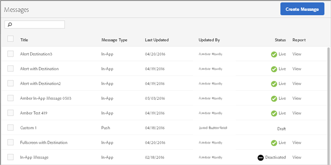

# Hantera meddelanden{#manage-messages}

Visa en lista över dina meddelanden i appen och push-meddelanden med information om när varje meddelande uppdaterades senast och om meddelandena är live eller har inaktiverats.

Du kan duplicera, aktivera/inaktivera samt arkivera/avarkivera meddelanden. Du kan också visa en rapport som visar antalet användare som har visat meddelandet och antalet användare som har klickat genom meddelandet.

Om du vill hantera meddelanden klickar du på ***your_app_name*** > **[!UICONTROL Messaging]** > **[!UICONTROL Manage Messages]**.

Här finns ytterligare information om de uppgifter du kan utföra i meddelanden:

* **Söka och filtrera meddelanden**

   Använd sökrutan högst upp i listan för att söka efter och filtrera meddelanden. Allt du skriver i sökrutan visar matchande meddelanden från listan. Sökningen fungerar i alla tabellkolumner. Du kan till exempel skriva `Draft` om du bara vill visa meddelanden med den statusen. Du kan även skriva en användares namn för att endast visa meddelanden som har uppdaterats av den användaren.

   Förutom sökrutan kan du även klicka på valfri kolumnrubrik för att sortera listan i stigande eller fallande ordning efter innehållet i den kolumnen.

   Om du till exempel sorterar **[!UICONTROL Message Type]** i stigande ordning visas alla meddelanden i appen före dina push-meddelanden. Om du sorterar **[!UICONTROL Last Updated]** i fallande ordning visas de senast uppdaterade meddelandena högst upp i listan.

* **Duplicera meddelanden**

   1. Markera kryssrutan bredvid ett eller flera meddelanden och klicka på **[!UICONTROL Duplicate Selected]**.
   1. Välj det program som du vill duplicera ett meddelande för.
   1. Skriv ett namn för meddelandet.

      Om du vill duplicera ett meddelande för samma program skriver du ett nytt namn för meddelandet. Om du behåller samma namn för att skriva över det ursprungliga meddelandet. Om du duplicerar ett meddelande för ett annat program kan du behålla samma namn utan att skriva över det ursprungliga meddelandet.

   1. Klicka **[!UICONTROL Duplicate]** eller **[!UICONTROL Overwrite]**, efter behov.

* **Inaktivera eller aktivera meddelanden**

   Om du vill inaktivera ett meddelande markerar du kryssrutan bredvid minst ett aktivt meddelande och klickar på **[!UICONTROL Deactivate Selected]**.

   Om du vill aktivera ett inaktiverat meddelande markerar du kryssrutan bredvid minst ett inaktiverat meddelande och klickar på **[!UICONTROL Activate Selected]**.

* **Arkivera meddelanden**

   Så här arkiverar du meddelanden och rensar din meddelandelista:

   >[!TIP]
   >
   >Innan du kan arkivera ett meddelande måste du inaktivera det.

   1. Markera kryssrutan bredvid minst ett inaktiverat meddelande och klicka på **[!UICONTROL Archive Selected]**.

* **Visa arkiverade meddelanden**

   1. Klicka på **[!UICONTROL View Archive]**.
   1. Markera kryssrutan bredvid minst ett arkiverat meddelande och klicka på **[!UICONTROL Unarchive Selected]**.
