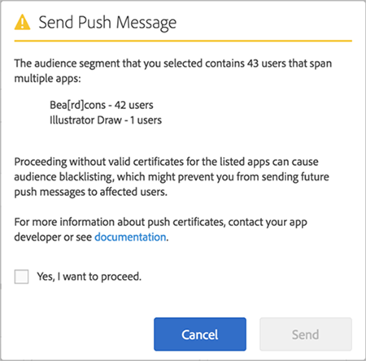

# Målgrupp: push-meddelanden{#audience-define-and-configure-audience-segments-for-push-messages}

{#eol}

Ni kan definiera och konfigurera målgruppsalternativ för push-meddelanden, inklusive datumintervallalternativ, analyssegment och anpassade segment.

## Definiera målgruppssegment {#section_7C4D2393CF7441959FE2381A02867CAC}

När ett målgruppssegment för push-meddelanden skapas kan segmentet omfatta användare från en eller flera appar, eftersom rapportsviter eller virtuella rapportsviter kan innehålla data från en eller flera appar. Mer information om virtuella rapportsviter finns i [Virtuella rapportsviter](/help/using/manage-apps/c-mob-vrs.md).

I Adobe Mobile Services kan marknadsförarna bara pusha till en app per plattform. Om marknadsförarna försöker skicka till segment som innehåller användare från flera appar visas en varning om att om man fortsätter kan det leda till allvarliga push-fel och att användare blocklist. Om ett push-fel uppstår, se *Lösa push-fel* in [Felsöka push-meddelanden](/help/using/in-app-messaging/t-create-push-message/c-schedule-push-message.md).

Information om hur du använder Audience Manager i segmentdefinitionen finns i [Audience Analytics](https://experienceleague.adobe.com/docs/analytics/integration/audience-analytics/mc-audiences-aam.html).

>[!IMPORTANT]
>
>Om appanvändare är blocklist kan marknadsförarna **aldrig** skicka push-meddelanden till berörda användare igen.

Om du väljer ett målgruppssegment som innehåller användare i flera appar kan du se följande varning:

Appnamnet baseras på den nedåtriktade versionen av appId, som automatiskt skickas till Adobe Analytics av Mobile Services SDK i `<app name> <version number> (<bundle id>)` format.

>[!TIP]
>
>Versionsnumret är valfritt.

Upp till 6 sifferuppsättningar för versionen och 5 sifferuppsättningar för paket-ID tas bort.

Exempel:

* `Bea[rd]cons 1.0 (123)` visas som `Bea[rd]cons`
* `Bea[rd]cons 1.2 (1.2)` visas som `Bea[rd]cons`
* `Bea[rd]cons 1.2.3.4.5.6.7 (1111)` visas som `Bea[rd]cons .7`
* `Bea[rd]cons 1.2.3. (1.2.3.4.5.6)` visas som `Bea[rd]cons (.6)`

Om du vill fortsätta skicka push-meddelandet till de angivna apparna väljer du **[!UICONTROL Yes, I want to proceed.]** kryssruta och klicka **[!UICONTROL Send]**.

## God praxis

Här är några tips att komma ihåg:

* För att minska förvirring **undvik** definiera virtuella rapportsviter för mobilappar som innehåller data från flera appar.
* Använd ett unikt program-ID som en del av ett målgruppssegment **var** när du vill skicka ett push-meddelande.
Detta garanterar att push-meddelanden skickas till ett målgruppssegment som tillhör **endast** ett program.

### Exempel

Här är några exempel som hjälper dig att förstå hur du definierar segment på rätt sätt:

**Gör**: Marketern tillhandahåller push-certifikat för iOS- och Android-versionerna av ett program, till exempel för Adobe Photoshop. Marknadsföraren kan skicka ett push-meddelande till ett användarsegment som sträcker sig över båda plattformarna.

**Gör inte**: Marknadsförarna tillhandahåller push-certifikat för iOS- och Android-versioner av ett program, till exempel för Adobe Photoshop. Om marknadsföraren skapar och knuffar till ett segment i *alla aktiva användare de senaste 30 dagarna*, är det bara användare av Adobe Photoshop iOS och Android-appen som får push-funktionen, och alla användare av Adobe Illustrator iOS och Android-apparna kommer att blocklist. Mer information finns i *Åtgärdar fel i push-meddelanden* in [Felsökning av push-meddelanden](/help/using/in-app-messaging/t-create-push-message/c-troubleshooting-push-messaging.md).

## Konfigurera målgruppssegment {#section_A92C60885A30421B8150820EC1CCBF13}

1. Gå till målgruppssidan för ett nytt push-meddelande.

   Mer information finns i [Skapa ett push-meddelande](/help/using/in-app-messaging/t-create-push-message/t-create-push-message.md).

   Kom ihåg följande när du konfigurerar målgruppsalternativen: **important** information:

   * The **[!UICONTROL Estimated Opt-In Audience]** är antalet enheter som matchar Adobe Analytics-segmentet **och** antalet enheter som valts in.

      Du kan visa en uppskattning av antalet användare i dina valda segment som har valt att ta emot meddelanden och som kommer att ta emot push-meddelandet. Det totala antalet appanvändare visas under uppskattningen, oavsett anmälningsstatus.

   * The **[!UICONTROL Total]** är antalet enheter som matchar Adobe Analytics-segmentet.

   * Push-meddelanden skickas till de enheter som ingår i ett definierat Adobe Analytics-segment **och** som har valt att skicka push-meddelanden.

      Detta innebär att SDK har skickat värdet `True` för Push Message Opt-In evar.

   * Även om enheten har en giltig enhetstoken skickas inte meddelandet till enheten, såvida inte Adobe Analytics har angett den valda flaggan.

2. Skriv information i följande fält:

   * **[!UICONTROL During The]**

      Skriv in tidsramen som ska användas för den beräknade målgruppen. Från **[!UICONTROL During The]** väljer du ett alternativ:

   * **[!UICONTROL Last]** Med kan du välja en relativ tidsram (t.ex. de senaste 7 dagarna, de senaste 30 dagarna eller de senaste 60 dagarna) från den tidpunkt då meddelandet schemaläggs att skickas.

      Om du t.ex. markerar de senaste 30 dagarna och schemalägger meddelandet att skickas den 31 oktober, är den beräknade målgruppen antalet användare som har valt att ta emot push-meddelanden 30 dagar före den 31 oktober.

   * **[!UICONTROL Static Range]** Med kan du välja ett statiskt intervall genom att välja start- och slutdatum för det uppskattade målgruppsintervallet.

      Om du i det föregående exemplet väljer ett datumintervall från 1 oktober till 15 oktober men schemalägger att meddelandet ska skickas 31 oktober, är den beräknade målgruppen det antal användare som har valt att ta emot push-meddelanden i det statiska datumintervall som du har angett (1 oktober till 15 oktober).

   * **[!UICONTROL Analytics Segments]**

      Markera ett befintligt Adobe Analytics-segment i listrutan. Mer information finns i [Segmentbyggare](https://experienceleague.adobe.com/docs/analytics/components/segmentation/segmentation-workflow/seg-build.html) i Adobe Analytics-dokumentationen.

   * **[!UICONTROL Custom Segments]**

      Välj ett mått eller en variabel i listrutan (till exempel **[!UICONTROL Days Since Last Use]** eller **[!UICONTROL Point of Interest]**) och konfigurera filtret efter behov. Följande anpassade segment är avsett för användare som har en mobiltelefon som kör iOS och som befinner sig i Kalifornien (USA).
   >[!IMPORTANT]
   >
   >I **[!UICONTROL Create Audience]** om du klickar **[!UICONTROL And]** visas en dialogruta som påminner dig om att se till att alla program som visas **måste** har ett giltigt certifikat. Om du klickade **[!UICONTROL Or]** visas standarddialogrutan. Mer information om giltiga certifikat och rapportsviter finns i [Virtuella rapportsviter](/help/using/manage-apps/c-mob-vrs.md).
