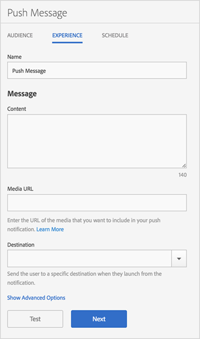

# Upplevelse: push-meddelande {#experience-push-message}

Du kan konfigurera upplevelsealternativ för push-meddelanden och omfattande push-meddelanden, inklusive namn, meddelandetext och målalternativ. Du kan också konfigurera avancerade alternativ, inklusive nyttolastalternativ och anpassade alternativ för iOS-enheter.

1. Klicka på **[!UICONTROL Experience]** på målsidan för ett nytt push-meddelande.

   

1. Skriv ett namn för det här meddelandet.
1. Skriv information i följande fält i avsnittet **[!UICONTROL Message]**:

   * **[!UICONTROL Content]**

      Ange texten i meddelandet. Du kan ange upp till 140 tecken.

   * **[!UICONTROL Media URL]**

      Skriv URL-adressen till den mediefil som du vill använda i push-meddelandet. Information om krav för att använda push-meddelanden finns i *Krav för push-meddelanden* nedan.

      >[!IMPORTANT]
      >
      >Kom ihåg följande om du vill visa en bild eller en video i ett push-meddelande:
      > * `attachment-url`-data hanteras i push-nyttolasten.
      > * Medie-URL:en måste kunna hantera begäranden om spikes.

   * **[!UICONTROL Destination]**

      Välj ett specifikt mål, till exempel en webb-, djup- eller hybridlänk, för att skicka användare när de klickar igenom meddelandet. Mer information finns i [Destinationer](/help/using/acquisition-main/c-create-destinations.md).

      >[!TIP]
      >
      >När du använder måltyperna * **[!UICONTROL Web Link]** eller **[!UICONTROL Custom Link]** spåras inte måltypen. Endast **[!UICONTROL Deep Links]** spåras.

## Krav för avancerade push-meddelanden

Här följer kraven för att skicka omfattande push-meddelanden:

* **Versioner som stöds**

   Omfattande push-meddelanden stöds i följande versioner:
   * Android 4.1.0 eller senare
   * iOS 10 eller senare

      >[!IMPORTANT]
      >
      >Kom ihåg följande information:
      >* Rich push-meddelanden som skickas till tidigare versioner skickas fortfarande, men endast texten visas.
      >* Det finns för närvarande inget stöd för bevakning.

* **Filformat**

   Här är de filformat som stöds:
   * Bilder: JPG och PNG
   * Animeringar (endast iOS): GIF
   * Videor (endast iOS): MP4

* **URL-format**
   * Endast HTTPS

* **Storleksändring**
   * Bilderna måste ha formatet 2:1, annars beskärs de.

Mer information om hur du konfigurerar avancerade push-meddelanden finns i följande innehåll:

* [Ta emot push-meddelanden i Android](/help/android/messaging-main/push-messaging/c-set-up-rich-push-notif-android.md)
* [Ta emot omfattande push-meddelanden i iOS](/help/ios/messaging-main/push-messaging/c-set-up-rich-push-notif-ios.md)

Så här konfigurerar du ett push-meddelande på Experience-sidan:

1. (**Valfritt**) Klicka på länken **[!UICONTROL Show Advanced Options]** för att konfigurera ytterligare alternativ:

   * **[!UICONTROL Payload: Data]**

      Ange en anpassad push-nyttolast i JSON som skickas till appen via en push-sändning eller ett lokalt meddelande. Gränsen för Android och iOS är 4 kB.

   * **[!UICONTROL Apple Options: Category]**

      Ange en kategori för push-meddelanden och lokala meddelanden. Mer information finns i [Hantera ditt programs meddelandestöd](https://developer.apple.com/library/content/documentation/NetworkingInternet/Conceptual/RemoteNotificationsPG/SupportingNotificationsinYourApp.html#//apple_ref/doc/uid/TP40008194-CH4-SW9) i *iOS Developer Library*.

   * **[!UICONTROL Apple Options: Sound]**

      Ange namnet på ljudfilen i apppaketet som ska spelas upp. Ett standardlarmljud spelas upp om det inte anges. Mer information finns i [Hantera ditt programs meddelandestöd](https://developer.apple.com/library/content/documentation/NetworkingInternet/Conceptual/RemoteNotificationsPG/SupportingNotificationsinYourApp.html#//apple_ref/doc/uid/TP40008194-CH4-SW10) i *iOS Developer Library*.

   * **[!UICONTROL Apple Options: Content Available]**

      Välj det här alternativet så att iOS när meddelandet kommer, aktiverar din app i bakgrunden och gör att din app kan köra kod baserat på meddelandets nyttolast. Mer information finns i [Apple Push Notification Service](https://developer.apple.com/library/content/documentation/NetworkingInternet/Conceptual/RemoteNotificationsPG/APNSOverview.html#//apple_ref/doc/uid/TP40008194-CH8-SW1) i *iOS Developer Library*.

1. (Valfritt) Förhandsgranska layouten för meddelandet genom att klicka på följande ikoner:

   * **[!UICONTROL x Summary]**

      Döljer förhandsgranskningsfönstret. Klicka på  för att visa förhandsgranskningsfönstret igen.

   * **[!UICONTROL Change the orientation]**

      Om du vill ändra orienteringen för förhandsvisningen från stående till liggande klickar du på . För provkartor ändras orienteringen från en rund bevakningsyta till en fyrkantig bevakningsyta.

   * **[!UICONTROL Preview on a user's watch]**

      Om du vill förhandsgranska meddelandet så som det kommer att visas på en användares färgrutor klickar du på .

   * **[!UICONTROL Preview on a user's mobile phone]**

      Om du vill förhandsgranska meddelandet så som det kommer att visas på en användares mobiltelefoner klickar du på .

   * **[!UICONTROL Preview on a user's tablet]**

      Om du vill förhandsgranska meddelandet på en surfplatta klickar du på ikonen .
   Längst ned i förhandsgranskningsfönstret kan du visa en beskrivning av målgruppen som du valde i föregående steg.

1. (**Valfritt**) Klicka på **[!UICONTROL Test]** om du vill skicka meddelandet till angivna enheter för testning.
1. Markera tjänsten och skriv push-tokens för minst en enhet som du vill skicka meddelandet till.

   Ange token i en kommaavgränsad lista för att skicka meddelandet till mer än en enhet.

1. Konfigurera schemaläggningsalternativen för meddelandet.

   Mer information finns i [Schema: push-meddelande](/help/using/in-app-messaging/t-create-push-message/c-schedule-push-message.md).
