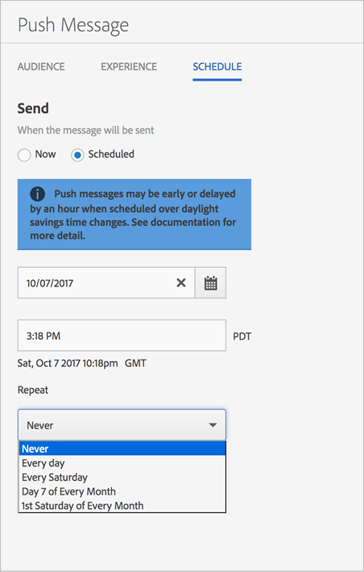

# Schema: push-meddelanden{#schedule-push-message}

I Adobe Mobile Services-gränssnittet kan du schemalägga att ett push-meddelande ska levereras omedelbart, skickas senare och som en återkommande händelse. Dessa händelser kan schemaläggas varje dag, vecka eller månad.

>[!TIP]
>
>Användarna kan när som helst ändra schemaläggningsinställningarna för ett push-meddelandejobb. Om det inte finns något datum för att skicka ett återkommande schemalagt meddelande, till exempel ett återkommande månadsjobb var 31:e dag, den 31:e februari eller den 5:e tisdagen i månaden, skickas inget meddelande.

Kom ihåg följande information:

* Rätt datum- och tidsformat är `hh:mm` och `mm/dd/yyyy`.

* Du kan redigera ett schemalagt meddelande på följande sätt:

   * Ändra datumet till ett senare datum.
   * Ändra upprepningsintervallet till ett annat intervall.

      Om du till exempel ursprungligen hade ett meddelande som skickades varje dag, kan du växla upprepningen till veckovis.

## Före schemaläggning av återkommande push-meddelanden

Du **måste** förstå följande information innan du schemalägger återkommande push-meddelanden:

* Vilka alternativ som visas i **[!UICONTROL Repeat]** listrutan beror på vilket datum du skrev eller valde.

   Om du t.ex. skriver `Saturday, October 7`visas följande alternativ:

   * **[!UICONTROL Never]**
   * **[!UICONTROL Every day]**
   * **[!UICONTROL Every Saturday]**
   * **[!UICONTROL Day 7 of Every Month]**
   * **[!UICONTROL 1st Saturday of Every Month]**

* Push-meddelanden schemaläggs och skickas baserat på GMT (Greenwich Mean Time).

   Om du till exempel har schemalagt ett återkommande meddelande som ska skickas varje lördag kl. 12.00 (kl. 12.00) **PST**, med början den 7 oktober, skickas meddelandet på lördag kl. 19.00 ( **GMT**).
* Meddelanden skickas olika beroende på om du befinner dig i USA, Europa eller Asien.

   Om du till exempel befinner dig i San Jose i Kalifornien och planerar att skicka ett meddelande den 31 ***oktober klockan 17:30*** PST **, skickas meddelandet den 1*****november klockan 12:30*** GMT ****. Om du bor i Tokyo och planerar att skicka ett meddelande den 1 ***januari*** kl. 17.30, skickas det den 31 ***december*** kl. 8.30 **GMT**.
* Push-meddelanden skickas en timme tidigare eller senare beroende på när ljusbesparingen sker.
* När du tittar på din push-meddelanderapport visas meddelandet i den lokala tidszonen i ditt system.

   Om du till exempel har starttiden 12:00 **PST**, trots att meddelandet skickas **GMT** kl. 17:00, visar meddelanderapporten den tid som skickas som 12:00 **PST**.

## Schemalägg ett återkommande push-meddelande {#section_675BD754E5A04423A1751193698A978F}

1. Välj **[!UICONTROL Scheduled]** eller **[!UICONTROL Now]** på sidan Schemalägg för ett nytt push-meddelande.

   Mer information finns i [Skapa ett push-meddelande](/help/using/in-app-messaging/t-create-push-message/t-create-push-message.md).

   Om du valde **[!UICONTROL Now]** det här alternativet skickas meddelandet omedelbart. Om du vill förhindra att meddelandet schemaläggs direkt klickar du på **[!UICONTROL Save as Draft]**.

   

1. Om du markerade **[!UICONTROL Scheduled]** klickar du på kalenderikonen och väljer eller skriver ett startdatum.
1. Skriv in en tid. 
1. Under **[!UICONTROL Repeat]** väljer du något av följande alternativ:

   * **[!UICONTROL Never]**
   * **[!UICONTROL Every day]**
   * **[!UICONTROL Every Tuesday]**
   * **`<Day x>`i månaden **

      Vilka alternativ som visas varierar beroende på vilken dag du valde eller skrev som startdag.
   * **`<nth day>`varje månad **

      Det visade värdet ändras beroende på vilket datum du valde eller skrev som startdatum.

1. I **[!UICONTROL End Repeat]** skriver du ett slutdatum och en sluttid.
1. Klicka på något av följande alternativ:

   * **[!UICONTROL Save as Draft]**

      Med det här alternativet sparas meddelandet i utkastformat. Du kan välja det här alternativet om du vill spara ett meddelande som inte är färdigt eller om du vill spara det så att någon annan kan redigera och godkänna det innan du aktiverar det.

      Om du valde **[!UICONTROL Now]** i det föregående steget skickas utkastet till meddelande omedelbart vid aktiveringen. Om du valde ett datum och en tid för att skicka meddelandet, skickas meddelandet enligt det här schemat.

   * **[!UICONTROL Save & Schedule]**

      Det här alternativet skickar meddelandet på den schemalagda dagen och tiden.

Gör något av följande om du vill skicka utkastet senare:

* Klicka **[!UICONTROL Manage Messages]**, markera kryssrutan bredvid meddelandet och klicka på **[!UICONTROL Activate Selected]**.
* Klicka **[!UICONTROL Save & Send]** för att spara meddelandet och skicka det.
