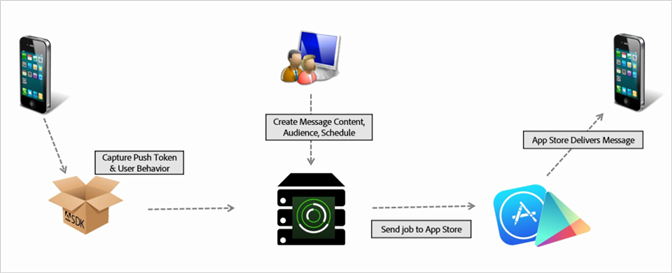

# Skapa ett push-meddelande {#create-a-push-message}

{#eol}

Ni kan skicka push-meddelanden till analyssegment från gränssnittet för mobiltjänster för att utnyttja era stabila analysdata samtidigt som ni engagerar användarna.

>[!IMPORTANT]
>
>Innan du skapar ett push-meddelande ska du läsa [Krav för att aktivera push-meddelanden](/help/using/c-manage-app-settings/c-mob-confg-app/configure-push-messaging/prerequisites-push-messaging.md).

Push-meddelanden visas för användare som har valt att ta emot meddelanden när de inte aktivt använder din app. Dessa meddelanden varnar användarna om nya uppdateringar, erbjudanden och påminnelser. Med dessa meddelanden kan du skapa, testa, hantera och rapportera push-meddelanden i ett smidigt arbetsflöde.

Push-meddelanden skickas på serversidan av appbutikerna i stället för från Adobe Mobile Services:

Så här skapar du ett push-meddelande:

1. Klicka ***your_app_name*** > **[!UICONTROL Messaging]** > **[!UICONTROL Manage Messages]** > **[!UICONTROL Create Message]** > **[!UICONTROL Create Push]**.
1. Konfigurera målgruppsalternativen.

   Mer information finns i [Målgrupp: definiera och konfigurera målgruppssegment för push-meddelanden](/help/using/in-app-messaging/t-create-push-message/c-audience-push-message.md).
