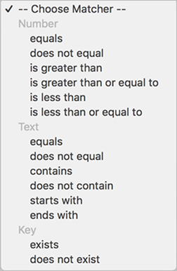

# Målgrupp: meddelande i appen {#audience-in-app-message}

Du kan konfigurera målgruppsalternativ för meddelanden i appen, inklusive alternativ för visning, utlösare och egenskaper.

1. Klicka på **[!UICONTROL Messaging]** > **[!UICONTROL Manage Messages]** > **[!UICONTROL Create Message]** > **[!UICONTROL Create In-App]**.
1. På sidan Målgrupp skriver du information i följande fält:

   * **[!UICONTROL View]**

      Välj det alternativ som utlöser ett meddelande som ska visas:

      * **[!UICONTROL Always]**

         Det här alternativet innebär att meddelandet visas varje gång som utlösaren inträffar.

      * **[!UICONTROL Once]**

         Det här alternativet innebär att meddelandet bara visas första gången som utlösaren inträffar.

      * **[!UICONTROL Until Click-Through]**

         Det här alternativet innebär att meddelandet visas varje gång som utlösaren inträffar tills användaren klickar igenom det. Den här utlösaren gäller endast helskärmsmeddelanden och varningsmeddelanden. De flesta meddelanden måste omdirigeras eller använda en resurs från Internet och visas inte om de är offline. Om du alltid vill visa meddelandet oavsett nätverksanslutning väljer du **[!UICONTROL Show Offline]** kryssruta.
   * **[!UICONTROL Trigger]**

      Välj ett alternativ i listrutan och välj ett villkor. Du kan till exempel välja **[!UICONTROL Launched]** från den första nedrullningsbara listan och **[!UICONTROL Exists]** från den andra listrutan. Du kan också ange anpassade kontextdata som måste finnas i den utlösande träffen för att meddelandet ska kunna visas.

      >[!IMPORTANT]
      >
      >Om du väljer flera utlösare måste alla utlösare inträffa vid samma träff för att meddelandet ska visas.

   * **[!UICONTROL Traits]**
Du kan bestämma vem som ska se meddelandet i appen när det utlöses och filtrera (segmentera) målgruppen så att den träffar som har angivna data. Du kan till exempel definiera en regel där intressepunkter innehåller Denver. Med det här filtret kan du visa meddelandet till kunder som befinner sig i någon av dina intressepunkter hos Denver i namnet vid utlösningstidpunkten.

## Ytterligare information om egenskaper och utlösare {#section_48C39EFB8CAA4F62B994FCC91DF588E6}

>[!IMPORTANT]
>
>Utlösare och traits använder data som skickas till Analytics från er app. Dessa värden skickas som kontextdata, mappade variabler och mätvärden. En variabel är ett textbaserat värde och ett mätvärde är ett numeriskt värde.

Om du vill se mappningen av dessa nyckelvärdepar i användargränssnittet för Mobile Services och validera värdet för utlösaren klickar du på **[!UICONTROL Manage App Settings]** >  **[!UICONTROL Manage Variables & Metrics]** >, som visar följande flikar:

* **[!UICONTROL Standard Variables & Metrics]**
* **[!UICONTROL Custom Variables]**
* **[!UICONTROL Custom Metrics]**

När du har verifierat mappningen väljer du lämplig matchande eller logisk operator för att konfigurera målgruppen för meddelandet.

### Välja mått och variabler {#example_AB126F03BD1C4094B791E230B3DB1189}

Följande scenarier hjälper dig att avgöra om du ska välja ett mått eller en variabel som utlösare:

### Mätvärden

Ett mätvärde är ett tal och ett exempel är antalet inköp.

1. Klicka på **[!UICONTROL Manage Messages]** > **[!UICONTROL Create Message]**.
1. Utför följande steg i **[!UICONTROL Trigger]** i **[!UICONTROL Audience]** tab:

   1. Välj en standardhändelse som **[!UICONTROL Launched]** och markera **[!UICONTROL exists]**.
   1. Välj en andra utlösare som är en anpassad datapunkt och som mappas till ett mätvärde.
   1. Under **[!UICONTROL Number]** väljer du ett matchningsalternativ.

### Variabler

En variabel är en textsträng som är en unik identifierare, och exempel innehåller land, flygplats och så vidare.

1. Klicka på **[!UICONTROL Manage Messages]** > **[!UICONTROL Create Message]**.
1. Utför följande steg i **[!UICONTROL Trigger]** i **[!UICONTROL Audience]** tab:

   1. Välj en standardhändelse som **[!UICONTROL Launched]** och markera **[!UICONTROL exists]**.
   1. Välj en andra utlösare som är en anpassad datapunkt och som mappas till en variabel.
   1. Under **[!UICONTROL Text]** väljer du ett matchningsalternativ.

Mer information om kontextdata, variabler och mätvärden finns i [Hantera din app](/help/using/manage-apps/manage-apps.md).
