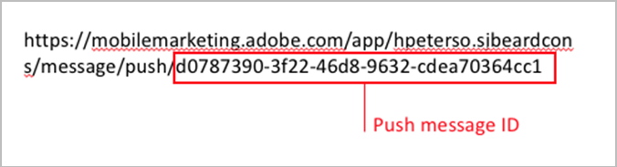
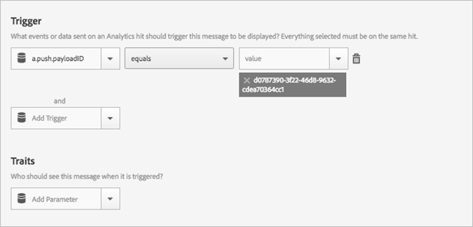

# Utlös ett meddelande i appen när appen öppnas från ett push-meddelande{#trigger-an-in-app-message-when-the-app-is-opened-from-a-push-message}

Du kan ange att utlösaren för meddelanden i appen ska vara det push-meddelande-ID som skickas när en användare öppnar appen från push-meddelandet.

1. Hämta push-meddelande-ID:t för det push-meddelande som ska skickas till användaren.

   Du kan hitta ID:t för push-meddelandet i URL:en när du skapar meddelandet.

   Här är ett exempel:

   

1. Spara och aktivera meddelandet i appen med följande utlösare:

   `“a.push.payloadID” =`

   >[!TIP]
   >
   >ID:t för push-meddelandet är det ID som du placerade i steg 1.

   Den här utlösaren måste läggas till manuellt eftersom den inte är tillgänglig i **[!UICONTROL Trigger]** listrutan.

   

1. Spara och skicka push-meddelandet som har det push-ID som du hittade i steg 1.
1. Klicka igenom push-meddelandet för att öppna programmet och verifiera att meddelandet i appen visas när appen öppnas.

   Tänk på följande information när du testar:

   * När du har sparat meddelandet i appen tar det ca 45 sekunder för den värdbaserade konfigurationsfilen att uppdateras med det nya meddelandet.
   * Programmet söker efter uppdateringar av konfigurationsfiler (det nya meddelandet i appen) när det finns en **ny** start, så du måste se till att programmet startar en ny start när du klickar på push-meddelandet.
   Det innebär vanligtvis att du måste se till att tidsgränsen för sessionen har uppnåtts. Standardtidsgränsen är 5 minuter.

