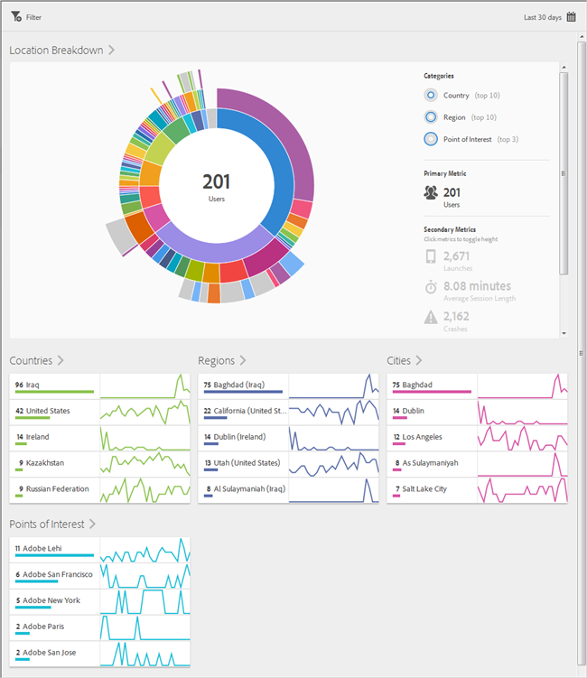
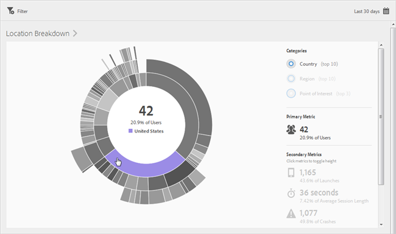
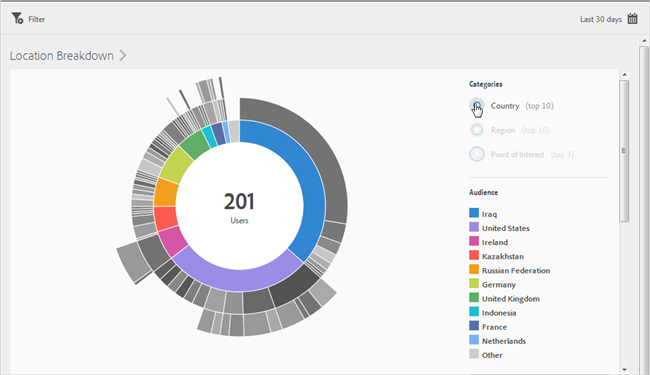
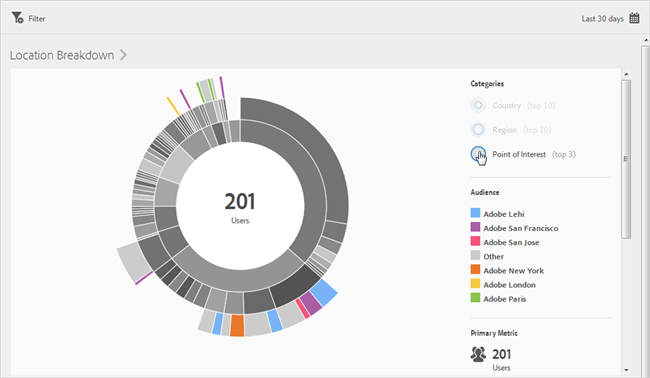
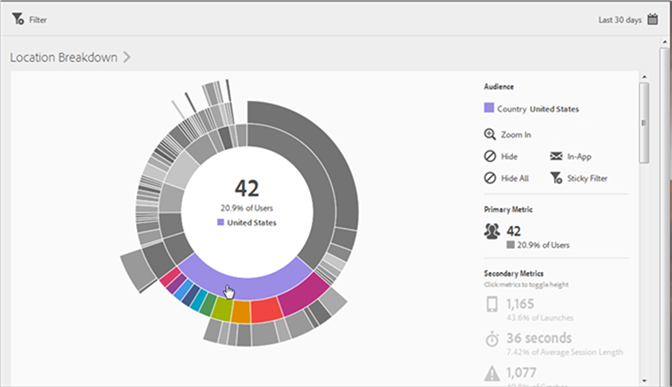
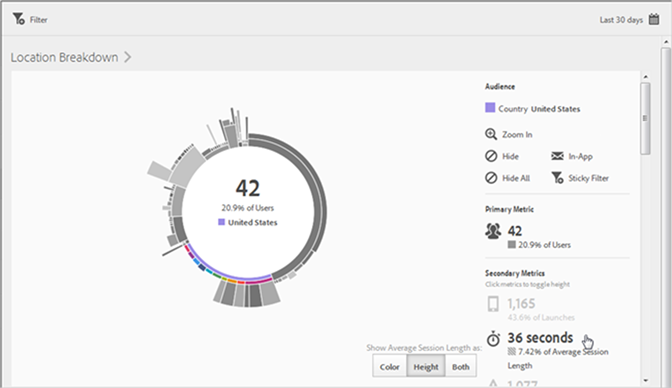
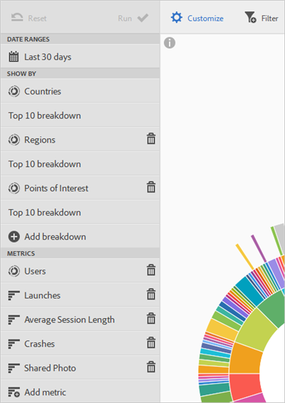

# Översikt (plats){#overview-location}

The **[!UICONTROL Location Overview]** kan du se de olika länder, regioner och intressepunkter (POI) där appen används.

Den här rapporten innehåller en solbränsvisualisering för era befintliga data, och du kan använda rapporten för att identifiera målgruppssegment (samlingar av besökare) för målinriktning. Att skapa och hantera målgrupper liknar att skapa och använda segment, förutom att du kan göra målgrupperna tillgängliga i Experience Cloud.

Här är ytterligare information om den här rapporten:

## Navigering och användning {#section_4A88C3849B5847BF8CF433CCFD99FDC3}

Den här visualiseringen ger till exempel basrapporten med uppdelningar. I visualiseringen används höjd för att visa de mått som är i fokus och prestandaskillnaderna mellan mätvärdena. Varje ring representerar ett målgruppssegment i ringens kategori. Du kan vidta åtgärder för en viss målgrupp, t.ex. använda ett klisterfilter, dölja ett mätvärde och visa mätvärden.

>[!TIP]
>
>Förutom den här informationen kan du se en självstudiekurs i produkten som beskriver hur du interagerar med soldiagram. Starta självstudiekursen genom att klicka på **[!UICONTROL Location Breakdown]** i rapportens namnlist och klicka på **[!UICONTROL i]** ikon.

Soldiagram är interaktivt. Du kan ändra tidsperioden genom att klicka på **[!UICONTROL Calendar]** ikonen längst upp till höger. För musen över någon del av diagrammet för att visa mer information. På följande bild kan du till exempel se det totala antalet och procentandelen användare som använder din app i USA.

I den här bilden **[!UICONTROL Categories]** med knapparna i det övre högra hörnet kan du växla mellan att visa information om de tio viktigaste länderna, regionerna och de tre översta **[!UICONTROL Points of Interest]**.

Här är visualiseringen när du väljer **[!UICONTROL Country]**:

Här är visualiseringen när du väljer **[!UICONTROL Points of Interest]**:

Du kan klicka på ett segment i ringen för att välja den målgrupp där du kan utföra åtgärder, till exempel zooma in, dölja målgrupper, skapa ett meddelande i appen eller ett klisterfilter.

Du kan klicka på ett sekundärt mått till höger för att lägga till det i visualiseringen och visa det här måttet med hjälp av färg, höjd eller båda.

## Lägg till uppdelningar och mätvärden {#section_15833511E82648869E7B1EFC24EF7B82}

Du kan lägga till uppdelningar och sekundära mätvärden, vilket ändrar höjden på varje publik i förhållande till de andra målgrupperna i diagrammet.

>[!TIP]
>
>Ju fler ringar du lägger till i solbrännet, desto längre tid tar det att bearbeta.

Om du vill lägga till uppdelningar och sekundära mått klickar du på **[!UICONTROL Location Breakdown]** i rapportens namnlist och klicka på **[!UICONTROL Customize]** för att öppna rätt spår.

När du klickar **[!UICONTROL Add Breakdown]** eller **[!UICONTROL Add Metric]** visas ett nytt objekt med samma namn som föregående objekt i respektive lista. Klicka på den nyligen skapade detaljnivån eller mätvärdet för att öppna en listruta där du kan välja ett nytt objekt.

## Skapa ett klisterfilter {#section_365999D49FC744ECBF9273132497E06C}

Klicka på ett segment i ringen för att välja målgruppen som du vill skapa ett klisterfilter för och klicka på **[!UICONTROL Sticky Filter]**. Med det här klisterfiltret kan du använda de aktuella filtren och köra en ny rapport baserad på filtren.

## Dela rapporter {#section_F8AF2AA73D4C4C008976D45847F82D0B}

När du har skapat en rapport används dina inställningar för att skapa en anpassad URL-adress som du kan kopiera och dela.

## Ytterligare information

Mer information om plats finns i följande innehåll:

* [Mappa](/help/using/location/c-map-points.md)
* [Hantera intressepunkter](/help/using/location/t-manage-points.md)
