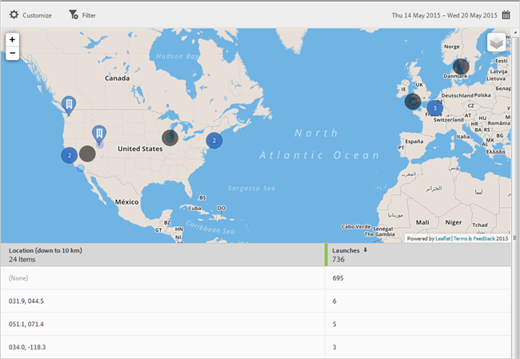

# Mappa {#map}

Du kan visa en interaktiv karta som visar POI och andra datamarkörer.

Här är viktig information att komma ihåg:

* Du kan öka eller minska storleken på kartan.

   Den här funktionen är till exempel användbar om du har två intressepunkter som är nära varandra. Om du förstorar kartan kan du visa den mer detaljerat.
* Dina intressepunkter visas i blått.

   Andra datamarkörer, till exempel Launches (Starta)), visas i svart. Klicka på en markör för att visa mer information.

Klicka på  om du vill välja följande alternativ:

* **[!UICONTROL Map ]**

   Visa en enkel karta.

* **[!UICONTROL Satellite]**
Visa kartan i satellitläge.

* **[!UICONTROL Data Markers]**

   Välj om svarta markörer ska visas.

* **[!UICONTROL Heat Map]**

   Välj om du vill visa värmemappsmarkörer. Ju högre intensitet färgen har, desto oftare uppfylls villkoret (till exempel Launches).

* **[!UICONTROL Points of Interest]**

   Välj om du vill visa dina intressepunkter.

Du kan konfigurera följande alternativ för den här rapporten:

* **[!UICONTROL Time Period]**

   Klicka på ikonen **[!UICONTROL Calendar]** för att välja en anpassad punkt eller för att välja en förinställd tidsperiod i listrutan.

* **[!UICONTROL Customize]**

   Anpassa dina rapporter genom att ändra **[!UICONTROL Show By]**-alternativen, lägga till mätvärden och filter, lägga till ytterligare serier (mätvärden) med mera. Mer information finns i [Anpassa rapporter](/help/using/usage/reports-customize/t-reports-customize.md).

* **[!UICONTROL Filter]**

   Klicka på **[!UICONTROL Filter]** för att skapa ett filter som sträcker sig över olika rapporter för att se hur ett segment fungerar i alla mobila rapporter. Med ett klisterlappsfilter kan du definiera ett filter som ska användas på alla rapporter som inte är avsedda för målning. Mer information finns i [Lägga till ett klisterfilter](/help/using/usage/reports-customize/t-sticky-filter.md).

* **[!UICONTROL Download]**

   Klicka på **[!UICONTROL PDF]** eller **[!UICONTROL CSV]** för att hämta eller öppna dokument och dela med användare som inte har tillgång till Mobile Services eller för att använda filen i presentationer.
