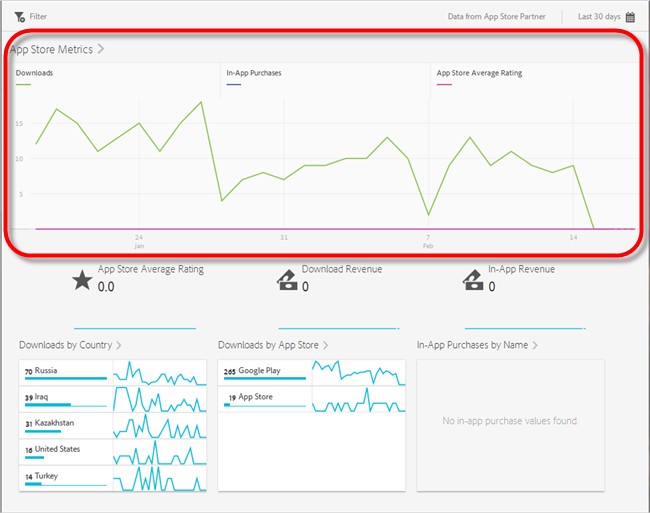
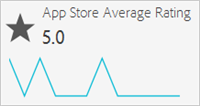
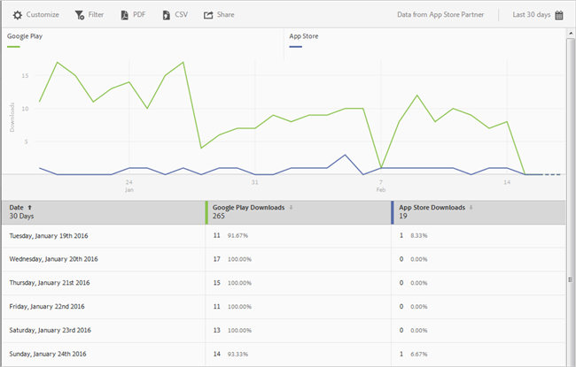
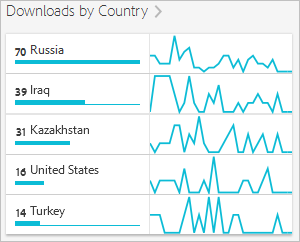
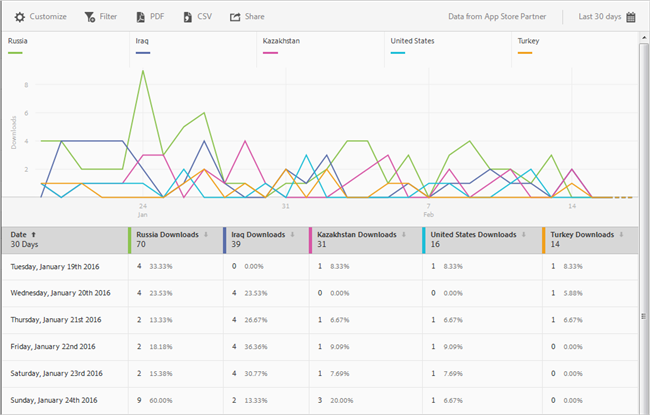
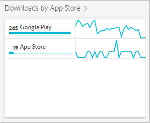

# App Store - översikt{#app-store-overview-report}

**[!UICONTROL App Store Overview]**-rapporten innehåller en ögonblicksbild av dina mått för appbutiker, inklusive antalet hämtningar, köp i appen, genomsnittlig klassificering, nedladdningsintäkt, intäkter i appen, hämtningar per land, hämtningar per appbutik och köp i appen per namn.

>[!TIP]
>
>I gränssnittet för mobila tjänster visas menyalternativen **[!UICONTROL App Store]** och **[!UICONTROL Overview]** i den vänstra navigeringsmenyn när du har konfigurerat integreringen.

**[!UICONTROL Overview]**-rapporten innehåller ett diagram över tiden som visar information om antalet hämtningar av appbutiker, köp i appen som gjorts med appen och appens genomsnittliga klassificering.

Du kan klicka på ett mätresultat om du vill dölja eller visa motsvarande rad. Håll markören över den dagen om du vill visa data för en dag.

>[!IMPORTANT]
>
>Mätvärden för App Store, t.ex. nedladdningar, rankning, intäkter, omdömen och så vidare, i Adobe Analytics kräver en integrering med en lämplig leverantör. `appFigures` ger för närvarande en integrering, vilket kräver att du köper rätt produkt och/eller tjänst från  `appFigures` **** innan du kan aktivera integreringen. Mer information om integrering av Data Connector finns i [Adobe Exchange](https://www.adobeexchange.com/experiencecloud.html).

>[!TIP]
>
>Förutom att ändra rapportens datumintervall genom att klicka på kalenderikonen i det övre högra hörnet kan du anpassa några av detaljrapporterna, lägga till filter och serier (mätvärden), lägga till klisterfilter och hämta rapporten i PDF- eller CSV-format. Mer information finns i [Anpassa rapporter](/help/using/usage/reports-customize/reports-customize.md).

## Genomsnittlig klassificering i App Store {#section_60D0D21824AE4450BC3E34D7ACA12A7A}

Den här rapporten visar den genomsnittliga klassificering som användare gav din app med hjälp av appbutiksfunktioner.

Du kan klicka var som helst på **[!UICONTROL App Store Average Rating]**-widgeten för att visa ett diagram och diagram som visar den genomsnittliga klassificeringen per datum. Håll markören över den dagen om du vill visa data för en dag.

## Ladda ned intäkter {#section_34F05998E8444544A1B507C1B852C4EE}

I den här rapporten visas de intäkter som genereras när appen hämtas.

## Intäkter i appen {#section_58792ED9C4B54B7D836E30CF09E8E204}

I den här rapporten visas hur mycket pengar som har kommit från köp i appen som gjorts med din app.

## Nedladdningar per land {#section_10373CD28CA94BA5859DFDEED7D548C6}

Den här rapporten visar antalet nedladdningar för din app grupperade efter land.

Om du vill visa ett diagram som visar antalet nedladdningar per land och datum klickar du på **[!UICONTROL Downloads by Country]**. Du kan hovra över ett datum för att visa data för en dag.

## Nedladdningar via App Store {#section_F1CD1A3F0105469D879E4F280CE32484}

Den här rapporten visar antalet hämtningar för din app grupperade efter appbutik.

Om du vill visa ett diagram som visar antalet nedladdningar per appbutik grupperade efter datum klickar du på **[!UICONTROL Downloads by App Store]**. Du kan hovra över ett datum för att visa data för den dagen.

## Köp i appen efter namn {#section_D747A64F9F6449E0A02EF31D56C92F83}

Den här rapporten visar alla köp i appen per namn.
