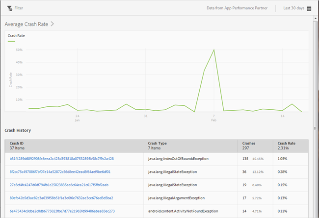

# Kraschrapport {#crashes}

{#eol}

The **[!UICONTROL Crashes]** rapporten innehåller en ögonblicksbild av programmets krascher. Du kan se hur många krascher och krascher som har inträffat och logga in i användargränssnittet för Apteligent.

>[!IMPORTANT]
>
>Visa **[!UICONTROL Crashes]** i den vänstra navigeringen måste du först integrera appen med Apteligent.

The **[!UICONTROL Average Crash Rate]** diagram visar kraschfrekvensen per datum. Du kan hovra över vilket datum som helst för att visa kraschfrekvensen för den dagen.

The **[!UICONTROL Crash History]** diagram visar information om varje appkrasch, inklusive krasch-ID, typ av krasch, nummer eller krascher samt krasch. Om du vill logga in på Aptelige för att visa mer information om en krasch klickar du på länken i **[!UICONTROL Crash ID]** kolumn.

Du kan konfigurera följande alternativ för den här rapporten:

* **[!UICONTROL Time Period]**

   Klicka på **[!UICONTROL Calendar]** om du vill välja en anpassad punkt eller välja en förinställd tidsperiod i listrutan.

* **[!UICONTROL Filter]**

   Klicka **[!UICONTROL Filter]** för att skapa ett filter som spänner över olika rapporter för att se hur ett segment fungerar i alla mobilrapporter. Med ett klisterlappsfilter kan du definiera ett filter som ska användas på alla rapporter som inte är avsedda för målning.

   Mer information finns i [Lägga till ett klisterfilter](/help/using/usage/reports-customize/t-sticky-filter.md).
