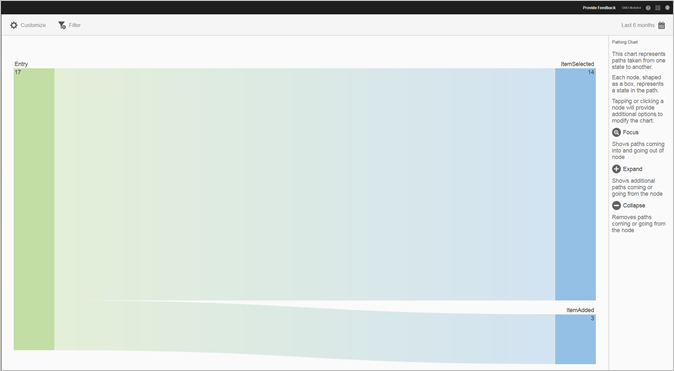
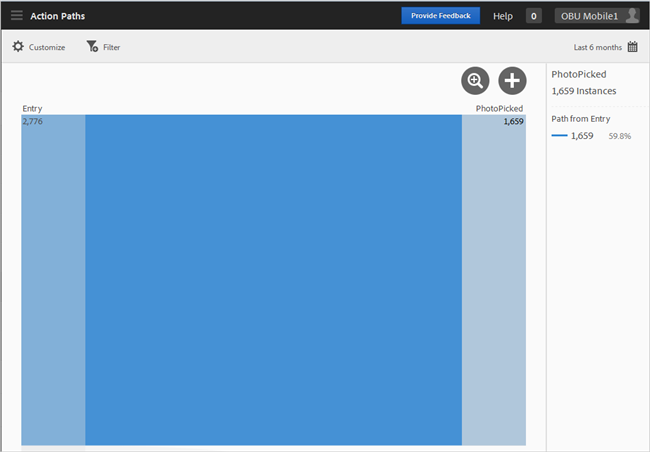
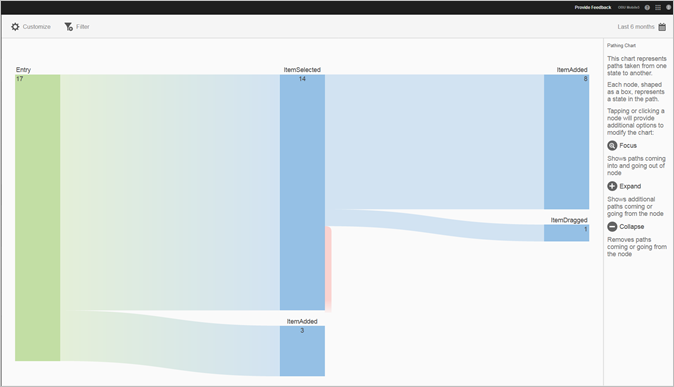
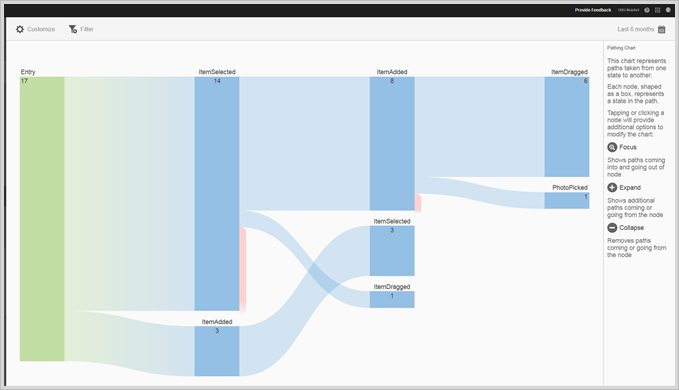

# Rapporten Handlingsvägar{#action-paths}

Rapporten Åtgärdssökvägar baseras på sökvägsanalys och visar ett bandiagram som representerar de sökvägar som har tagits från ett läge till ett annat i appen.

Båda **[!UICONTROL View Paths]** och **[!UICONTROL Action Paths]** rapporter är lappningsrapporter. The **[!UICONTROL View Paths]** rapporten visar hur användare navigerar i appen från en skärm till nästa. The **[!UICONTROL View Actions]** rapporten visar den sekvens av åtgärder och händelser, som klickningar, markeringar, storleksändring och så vidare, som användare utför i din app.

>[!TIP]
>
>Du kan använda en trattrapport för att kombinera navigering och åtgärder i en rapport. Mer information finns i [Tratt](/help/using/usage/reports-funnel.md).

Varje nod, i form av en ruta, representerar ett läge i användarnas sökvägar via en app. I bilden ovan representerar till exempel den översta noden antalet användare som startade appen och sedan valde ett foto från galleriet.

Om du vill visa alternativ för att ändra diagrammet klickar du på en nod och klickar på **[!UICONTROL Focus]** eller **[!UICONTROL Expand]**. Om du till exempel klickar på **[!UICONTROL PhotoPicked]** i den övre noden, **[!UICONTROL Focus]** och **[!UICONTROL Expand]** visas ikoner.

Om du vill expandera klickar du på **[!UICONTROL +]** ikon. Det här alternativet visar de ytterligare sökvägar som kommer in i eller ut ur noden. I bilden nedan startar läge 1 appen, läge 2 väljer ett foto (det objekt du tidigare expanderade) och läge 3 omfattar de olika sökvägar som användarna tog:

* Markera ett objekt
* Lägga till ett objekt
* Dra ett objekt
* Skalförändra ett objekt

Att expandera ett läge liknar en tratt.

Om du vill isolera noden och visa sökvägar som kommer in i och går ut ur den markerade noden klickar du på   ikon. I bilden nedan har följande banor fyllts i **före** användare har valt ett foto:

* Rotera ett objekt
* Skalförändra ett objekt
* Dra ett objekt
* Ta bort ett objekt

Av de användare som markerade ett foto har följande sökvägar slutförts **efter** fotot har markerats:

* Markera ett objekt
* Lägga till ett objekt
* Dra ett objekt
* Skalförändra ett objekt

Du kan fokusera eller utöka flera noder för att få en detaljerad vy över sökvägar som användarna använder i din app. Exempel:

Du kan konfigurera följande alternativ för den här rapporten:

* **[!UICONTROL Time Period]**

   Klicka på **[!UICONTROL Calendar]** om du vill välja en anpassad punkt eller välja en förinställd tidsperiod i listrutan.

* **[!UICONTROL Customize]**

   Anpassa dina rapporter genom att ändra **[!UICONTROL Show By]** alternativ, lägga till mätvärden och filter, lägga till ytterligare serier (mätvärden) med mera. Mer information finns i [Anpassa rapporter](/help/using/usage/reports-customize/reports-customize.md).

* **[!UICONTROL Filter]**

   Klicka **[!UICONTROL Filter]** för att skapa ett filter som spänner över olika rapporter för att se hur ett segment fungerar i alla mobilrapporter. Med ett klisterlappsfilter kan du definiera ett filter som ska användas på alla rapporter som inte är avsedda för målning. Mer information finns i [Lägga till ett klisterfilter](/help/using/usage/reports-customize/t-sticky-filter.md).

* **[!UICONTROL Download]**

   Klicka **[!UICONTROL PDF]** eller **[!UICONTROL CSV]** för att ladda ned eller öppna dokument och dela med användare som inte har tillgång till Mobile Services eller för att använda filen i presentationer.
