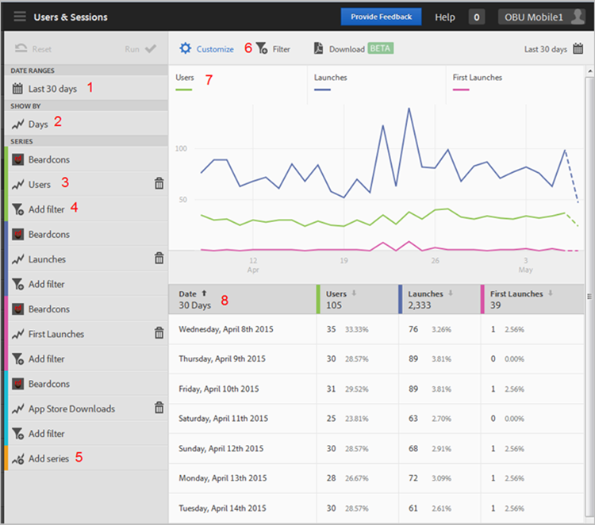

# Anpassa rapporter{#customize-reports}

Denna information hjälper er att förstå och anpassa de inbyggda rapporterna.

Du kan anpassa dina rapporter genom att ändra datumintervallet, **[!UICONTROL Show By]** alternativ (visa diagram- och tabelldata efter tidsperioder eller dimensioner), lägga till mått och värden, lägga till ytterligare serier (mätvärden) med mera.

Om du vill visa anpassningslisten klickar du på appens namn för att gå till sidan Översikt och klickar på **[!UICONTROL Customize]**.

I följande exempel visas rapporten Användare och sessioner med det öppna **[!UICONTROL Customize]** järnväg. I det här exemplet visas data för de senaste 30 dagarna, med fyra aktiva serier:

* **[!UICONTROL Users]**
* **[!UICONTROL Launches]**
* **[!UICONTROL First Launches]**
* **[!UICONTROL App Store Downloads]**

Följande information beskriver de olika områdena i rapporten och **[!UICONTROL Customize]** räl:

| Siffra | Beskrivning |
|--- |--- |
| 1 | I **[!UICONTROL Date Ranges]** kan du i listrutan välja olika datumintervall för rapporten. Alla data i diagrammet (9) och motsvarande tabell (10) respekterar det valda datumintervallet. |
| 2 | I **[!UICONTROL Show By]** kan du i listrutan välja en tidsbaserad eller dimensionsbaserad visning för rapporten.  I illustrationen ser du att Dagar är valt. Om du tittar på datumen nedanför diagrammet (7) och raderna i tabellen (8) kategoriseras data efter datum i en övertidsrapport. Högst sex mätvärden kan rapporteras för övertidsrapporter genom att ytterligare serier läggs till i rapporten.  Om du väljer en Livscykeldimension kan du visa de 50 översta värdena i en rankad lista, de 5 översta värdena per dag eller vecka eller en uppdelning av de 5 eller 10 översta värdena. |
| 3 | **[!UICONTROL Series]** representerar enskilda mått, t.ex. Users, Launches, First Launches och App Store Downloads, i ovanstående exempel. Varje serie färgkodas med data i diagrammet (7) och tabellen (8).  Du kan lägga till ytterligare serier (mätvärden) och till och med olika appar i olika rapportsviter för att jämföra data.  Mer information finns i  [Lägg till serier (mått) i rapporter](/help/using/usage/reports-customize/t-reports-series.md). |
| 4 | Med **[!UICONTROL Add Filter]** kan du anpassa de inbyggda rapporterna genom att lägga till ytterligare filter (segment).  Mer information finns i  [Lägg till filter i rapporter](/help/using/usage/reports-customize/t-reports-customize.md). |
| 5 | Med **[!UICONTROL Add Series]** kan ni anpassa de inbyggda rapporterna genom att lägga till ytterligare serier (mätvärden) eller appar i olika rapportsviter för att jämföra data.  Mer information finns i [Lägg till serier (mått) i rapporter](/help/using/usage/reports-customize/t-reports-series.md). |
| 6 | Med **[!UICONTROL Sticky Filter]** kan du skapa ett filter som sträcker sig över olika rapporter. Du kanske vill se hur ett visst segment fungerar i alla mobilrapporter. Med ett klisterlappsfilter kan du definiera ett filter som ska användas på alla rapporter som inte är målningsrapporter.  Mer information finns i [Lägg till anteckningsfilter](/help/using/usage/reports-customize/t-sticky-filter.md). |
| 7 | The **[!UICONTROL Data Chart]** visar data i ett lämpligt diagram baserat på de valda mätvärdena. Diagramtyperna inkluderar linjediagram, stapeldiagram, dondiagram osv. |
| 8 | The **[!UICONTROL Data Table]** visar data i tabellform. Du kan klicka på en kolumnrubrik om du vill sortera data i stigande eller fallande ordning. |
