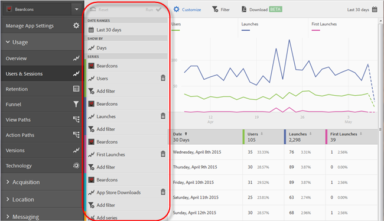

# Lägg till filter i rapporter{#add-filters-to-reports}

Den här informationen hjälper dig att anpassa de inbyggda rapporterna genom att lägga till ytterligare filter (segment).

>[!IMPORTANT]
>
>Mobile appstatistik finns också i marknadsföringsrapporter och -analyser, ad hoc-analyser, data warehouse och andra analysrapporteringsgränssnitt. Om det inte finns någon nedbrytning- eller rapporttyp i Adobe Mobile kan den genereras med ett annat rapporteringsgränssnitt.

I det här exemplet anpassar vi **[!UICONTROL Users & Sessions]** men instruktionerna gäller för alla rapporter.

1. Öppna appen och klicka på **[!UICONTROL Usage]** > **[!UICONTROL Users & Sessions]**.

   

   Den här rapporten ger en fullständig övertidsöversikt över våra appanvändare. Mätvärden för både iOS- och Android-versioner av den här appen samlas dock in i samma rapportserie. Vi kan segmentera användare med mobiloperativsystem genom att lägga till ett anpassat filter i användarens mått.

1. Klicka på **[!UICONTROL Customize]**.

   

1. Under **[!UICONTROL Users]**, klicka **[!UICONTROL Add Filter]** och klicka **[!UICONTROL Add Rule]**.

1. Välj **[!UICONTROL Operating Systems]** och i listrutan och väljer **[!UICONTROL iOS]**.

   

   Om du vill lägga till Android som ett filter måste du upprepa det här steget.

1. Klicka **[!UICONTROL And]**, markera **[!UICONTROL Operating Systems]** i listrutan och välj **[!UICONTROL Android]**.

   Filtren ska nu se ut som i följande exempel:

   

1. Klicka på **[!UICONTROL Update]**.
1. Om du vill återskapa rapporten klickar du på **[!UICONTROL Run]**.

   Den här rapporten visar nu användare uppdelade efter operativsystem. Rapporttiteln ändrades så att den matchar de filter som tillämpades på rapporten.

   

   Du kan anpassa den här rapporten mer. Från iOS 8.3 kan du lägga till måttet First Launches (Första starten) med ett versionsfilter för iOS 8.3 för att se hur många iOS 8.3-kunder som uppgraderade sina program och genomförde en första start.
1. Under **[!UICONTROL First Launches]**, klicka **[!UICONTROL Add Filter]**, klicka **[!UICONTROL Add Rule]**, markera **[!UICONTROL Operating Systems]** i listrutan och välj **[!UICONTROL iOS]**.
1. Klicka **[!UICONTROL And]**, markera **[!UICONTROL Operating System Versions]** i listrutan och välj **[!UICONTROL iOS 8.3]**.

   Filtren ska nu se ut som i följande exempel:

   

1. Klicka **[!UICONTROL Update]** och **[!UICONTROL Run]**.

   Den här rapporten visar nu användare med iOS 8.3 som har startat appen för första gången.

   

   Testa de olika alternativen på rapportanpassningsmenyn och se till att du bokmärker dina favoriter. Rapports-URL:er i Adobe Mobile fungerar och kan skickas med e-post eller läggas till i dina favoriter.
