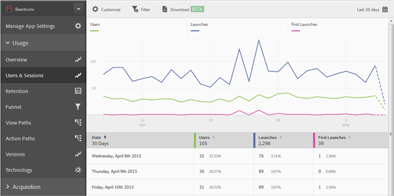
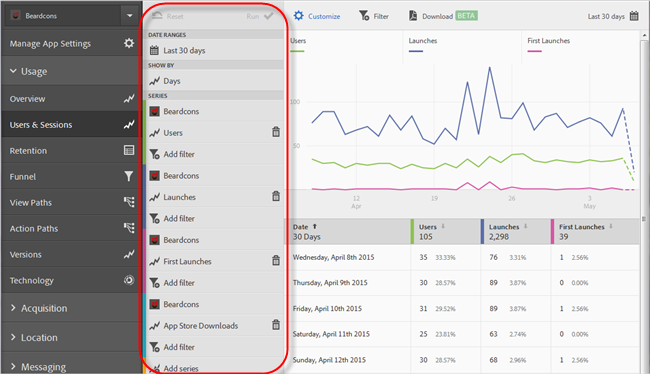
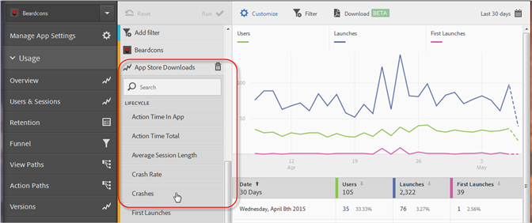
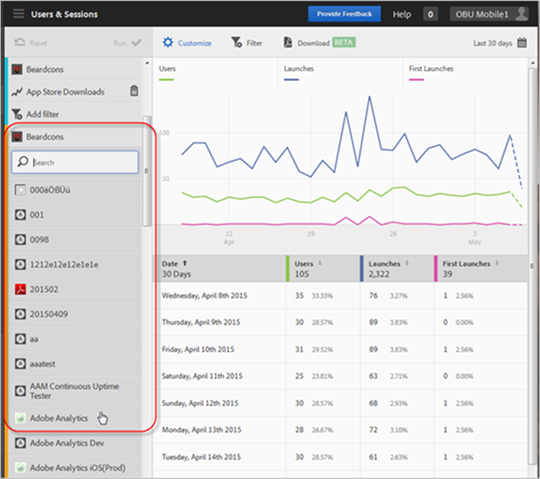

# Lägg till serier (mätvärden) i rapporter{#add-series-metrics-to-reports}

Den här informationen hjälper er att anpassa de inbyggda rapporterna genom att lägga till ytterligare serier (mätvärden) eller appar i olika rapportsviter för att jämföra data.

>[!IMPORTANT]
>
>Mätvärden för mobilappar finns också i marketing reports and analytics, ad hoc-analyser, data warehouse och andra analysrapporteringsgränssnitt. Om det inte finns någon nedbrytning- eller rapporttyp i Adobe Mobile kan den genereras med ett annat rapporteringsgränssnitt.

I det här exemplet anpassar vi **[!UICONTROL Users & Sessions]**-rapporten, men instruktionerna kan gälla för alla rapporter.

1. Öppna appen och klicka på **[!UICONTROL Usage]** > **[!UICONTROL Users & Sessions]**.

   

   Den här rapporten ger en fullständig övertidsöversikt över våra appanvändare. Vi vill dock lägga till en serie för att rapportera programkrascher.

1. Klicka på **[!UICONTROL Customize]**.

   

1. Bläddra nedåt och klicka på **[!UICONTROL Add Series]**.

   Seriens namn fylls i med samma namn som den sista serien i listan. I föregående bild är den senaste serien **[!UICONTROL App Store Downloads]**, så en ny serie läggs till och har även namnet **[!UICONTROL App Store Downloads]**.

1. Gör något av följande:

   * Om du vill lägga till en ny serie (metrisk) klickar du på namnet på den serie du just skapade och väljer ett nytt livscykelmått i listrutan.

      

   * Om du vill lägga till en ny app i en annan rapportserie så att du kan jämföra data mellan appar klickar du på appnamnet i den nyligen skapade serien och väljer önskad app.

      

1. (Villkorligt) Lägg till filter i den nya serien.

   Mer information finns i [Lägga till filter i rapporter](/help/using/usage/reports-customize/t-reports-customize.md).
1. Klicka på **[!UICONTROL Update]** och **[!UICONTROL Run]**.
