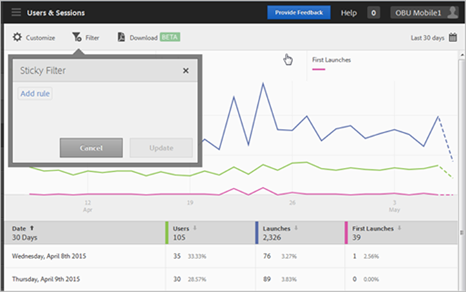
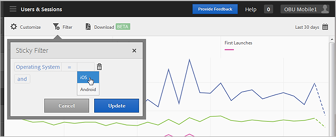
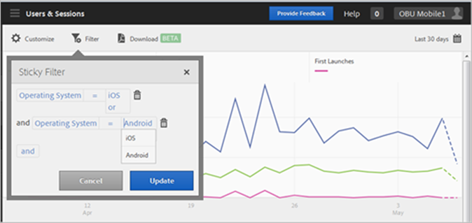

# Lägga till ett klisterfilter{#add-sticky-filter}

Skapa ett filter som spänner över olika rapporter för att se hur ett visst segment fungerar i alla mobilrapporter. Med ett klisterlappsfilter kan du definiera ett filter som ska användas på alla rapporter som inte är målningsrapporter.

I följande exempel läggs klisterfilter för iOS och Android till i **[!UICONTROL Users & Sessions]** men instruktionerna gäller alla rapporter och mätvärden.

1. Klicka på **[!UICONTROL Filter]** överst i en rapport i Adobe Mobile.

   

1. Klicka på knappen Fästfilter i dialogrutan Fästfilter **[!UICONTROL Add Rule]**, markera **[!UICONTROL Operating Systems]** och i listrutan väljer du **[!UICONTROL iOS]**.

   Om du vill lägga till Android som ett filter upprepar du det här steget.

   

1. Klicka **[!UICONTROL And]**, markera **[!UICONTROL Operating Systems]** och i listrutan väljer du **[!UICONTROL Android]**.

   Filtren ska nu se ut som i följande exempel:

   

1. Klicka **[!UICONTROL Update]** och **[!UICONTROL Run]**.
