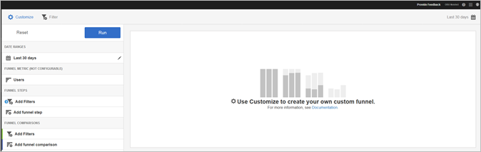
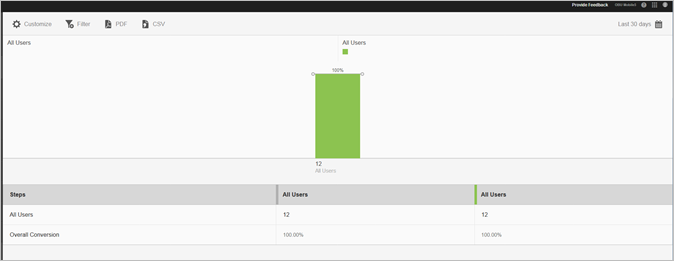

# Trattrapport{#funnel}

**[!UICONTROL Funnel]**-rapporten identifierar var kunderna övergav en marknadsföringskampanj eller avvände från en definierad konverteringsväg när de interagerade med mobilappen. Du kan också använda **[!UICONTROL Funnel]**-rapporten för att jämföra åtgärder för olika segment.

Genom att få insyn i kundens beslut i varje steg får ni en förståelse för var de är avskräckta, vilken väg de tenderar att följa och när kunderna lämnar er app.

När du öppnar **[!UICONTROL Funnel]**-rapporten måste du skapa en anpassad tratt. Mer information finns i [Anpassa rapporter](/help/using/usage/reports-customize/reports-customize.md).

>[!TIP]
>
>Spara URL:en när du har konfigurerat inställningarna och kör rapporten för att spara den anpassade tratten. Du kan dela URL-adressen eller spara den i ett dokument.

Här är ett exempel på den här rapporten:

För att demonstrera en enkel tratt finns inställningarna för en konfiguration som använder tre trattsteg och två trattjämförelser. Vi antar att en demoapp tillåter användare att lägga till ett objekt, till exempel ett foto, och sedan dela det.

I fönstret Anpassa finns det avsnitt som anger att användaren har startat appen, lagt till ett foto från ett galleri i appen, delat ett eller flera foton från appen på sociala medier, sms, e-post och så vidare. Med trattjämförelserna kan du jämföra nivåerna för att lägga till och dela foton mellan användare av iOS-appen och Android-appen.

Klicka på **[!UICONTROL Run]** om du vill generera rapporten.

Här är ett exempel på en genererad rapport:

Den första serien visar att 100 procent av användarna startade appen. Den andra serien visar att en högre andel Android-användare lade till ett foto från galleriet. Den tredje serien visar att nästan hälften av iOS-användarna delade fotot, men ingen av Android-användarna delade det. Detta kan tyda på ett problem med appen som behöver undersökas.

Om du vill visa ytterligare information för du musen över en stapel i diagrammet.

Du kan konfigurera följande alternativ för den här rapporten:

* **[!UICONTROL Time Period]**

   Klicka på ikonen **[!UICONTROL Calendar]** för att välja en anpassad punkt eller för att välja en förinställd tidsperiod i listrutan.
* **[!UICONTROL Customize]**

   Anpassa dina rapporter genom att ändra **[!UICONTROL Show By]**-alternativen, lägga till mätvärden och filter, lägga till ytterligare serier (mätvärden) med mera. Mer information finns i [Anpassa rapporter](/help/using/usage/reports-customize/reports-customize.md).
* **[!UICONTROL Filter]**

   Klicka på **[!UICONTROL Filter]** för att skapa ett filter som sträcker sig över olika rapporter för att se hur ett segment fungerar i alla mobila rapporter. Med ett klisterlappsfilter kan du definiera ett filter som ska användas på alla rapporter som inte är avsedda för målning. Mer information finns i [Lägg till anteckningsfilter](/help/using/usage/reports-customize/t-sticky-filter.md).
* **[!UICONTROL Download]**

   Klicka på **[!UICONTROL PDF]** eller **[!UICONTROL CSV]** för att hämta eller öppna dokument och dela med användare som inte har tillgång till Mobile Services eller för att använda filen i presentationer.
