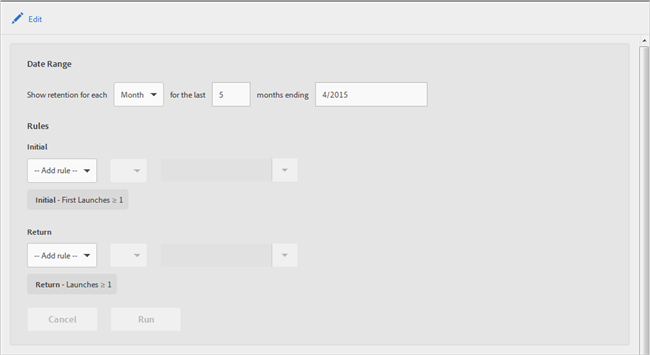

# Kvarhållningsrapport {#retention}

Rapporten (som tidigare kallades First Launch Cohorts) är en kohortrapport som visar hur många unika användare som har startat appen för första gången och sedan startat appen igen minst en gång de följande månaderna. **[!UICONTROL Retention]**

Som standard visas kvarhållandet av användargrupper i den här rapporten baserat på när användarna först startade programmet. Du kan också anpassa den här rapporten så att den använder en annan mätmetod än First Launch (Första starten) och lägga till ytterligare åtgärder.

En kohort är en grupp personer som delar en gemensam egenskap eller upplevelse under en viss period. Rapporten tar hänsyn till den vanligaste egenskapen hos de användare som installerade appen en viss dag, vecka eller månad och visar hur många av de användarna som startade appen under de kommande X dagarna, veckorna eller månaderna. **[!UICONTROL Retention]** Rapporten visar hur väl besökarna bibehölls som aktiva eller engagerade.

Här är ett exempel på den här rapporten:

I **[!UICONTROL MO]** kolumnen visas det totala antalet personer som startade appen för första gången i november 2014. I **[!UICONTROL M1]** kolumnen visas antalet personer som startade appen igen i december 2014 och så vidare.

Om du vill ändra datumintervallet eller redigera rapportens regler klickar du på **[!UICONTROL Edit]**.

Rapporten kan fyllas i med valfri variabel eller mätvärden, t.ex. Livscykelvärden, men inte beräknade värden.
