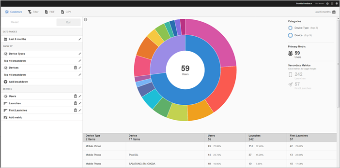

# Teknikrapport {#technology}

{#eol}

The **[!UICONTROL Technology]** kan du se de olika enhetstyper, operativsystem, operativsystemversioner och mobiloperatörer som appen används på.

Den här rapporten innehåller en solbränsvisualisering för era befintliga data, och du kan använda rapporten för att identifiera målgruppssegment (samlingar av besökare) för målinriktning. Att skapa och hantera målgrupper liknar att skapa och använda segment, förutom att du kan göra målgrupperna tillgängliga i Experience Cloud.

## Navigering och användning {#section_83CA60E1AE6245FEBCBFF3205615C4DF}

Den här visualiseringen innehåller till exempel basrapporten och uppdelningar, använder höjd för att visa måtten i fokus och prestandaskillnaderna mellan mätvärdena. Varje ring representerar ett målgruppssegment i ringens kategori. Du kan vidta åtgärder för en viss målgrupp, till exempel använda ett klisterfilter, dölja ett mätvärde och visa mätvärden.

>[!TIP]
>
>Förutom den här informationen kan du se en självstudiekurs i produkten som beskriver hur du interagerar med soldiagram. Starta självstudiekursen genom att klicka på **[!UICONTROL Technology Breakdown]** i rapportens namnlist klickar du på **[!UICONTROL Customize]** och klickar på **[!UICONTROL i]** ikon.

Soldiagram är interaktivt och du kan utföra följande uppgifter:

* För musen över någon del av diagrammet för att visa mer information.
* Ändra tidsperioden genom att klicka på knappen **[!UICONTROL Calendar]** ikon.
* Klicka på ett segment i ringen för att välja den målgrupp där du kan utföra åtgärder, som att zooma in, dölja målgrupper, skapa meddelanden i appen eller ett klisterfilter.
* I det övre högra hörnet väljer du **[!UICONTROL Device Type]** och **[!UICONTROL Device]** för att visa information om enheter och enhetstyper.

* Klicka på ett sekundärt mått till höger för att lägga till det i visualiseringen.

   Du kan visa det sekundära måttet med färg, höjd eller båda.

I följande tabell beskrivs standardrapporterna och hur de fylls i i Mobiltjänster:

| Rapport | Populationsmetod | Beskrivning |
|--- |--- |--- |
| Enhet | Livscykelstatistik | Vanliga mått uppdelade efter enhetstyp. |
| Operativsystem | Automatisk | Vanliga mått uppdelade efter operativsystem. |
| Operativsystemsversion | Livscykelstatistik | Vanliga mått uppdelade efter operativsystemsversion. |
| Operatörer | Automatisk | Vanliga mätvärden uppdelade efter transportföretag. |

>[!TIP]
>
>I **[!UICONTROL Carriers]** rapport, Wi-Fi-användare rapporteras som `none`.

## Lägg till uppdelningar och mått {#section_15833511E82648869E7B1EFC24EF7B82}

Du kan lägga till uppdelningar och sekundära mätvärden, vilket ändrar höjden på varje publik i förhållande till de andra målgrupperna i diagrammet.

>[!IMPORTANT]
>
>Ju fler ringar du lägger till i solbrännet, desto längre tid tar det att bearbeta.

Om du vill lägga till uppdelningar och sekundära mått klickar du på **[!UICONTROL Technology Breakdown]** i rapportens namnlist och klicka på **[!UICONTROL Customize]**.

När du klickar **[!UICONTROL Add Breakdown]** eller **[!UICONTROL Add Metric]** visas ett nytt objekt med samma namn som det föregående objektet i listan. Klicka på den nyligen skapade detaljnivån eller mätvärdet för att öppna en listruta där du kan välja ett nytt objekt.

## Skapa anteckningsfilter {#section_B4E355CD1FE34E4C8ADC38139ED67FC8}

Klicka på ett segment i ringen för att välja målgruppen som du vill skapa ett klisterfilter för och klicka på **[!UICONTROL Sticky Filter]**. Med det här filtret kan du använda de aktuella filtren och köra en ny rapport baserad på filtren.

## Dela rapporter {#section_560DD5CED5144249B7E49461E2422100}

När du har skapat en rapport används dina inställningar för att skapa en anpassad URL som du kan kopiera och dela.
