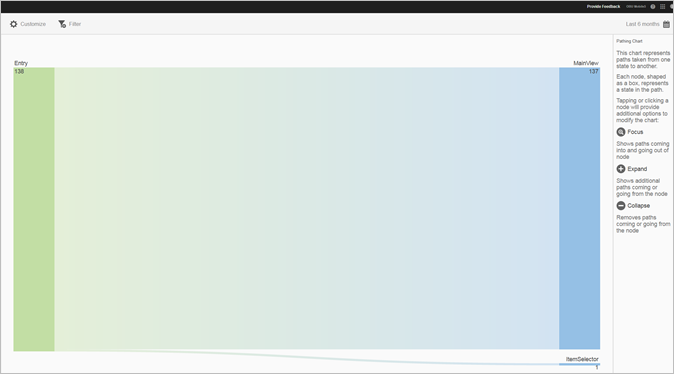
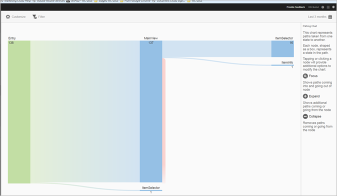
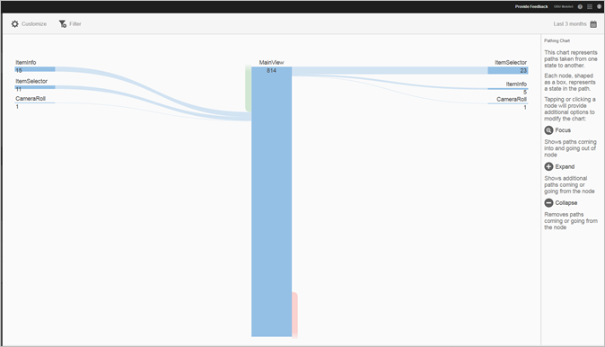
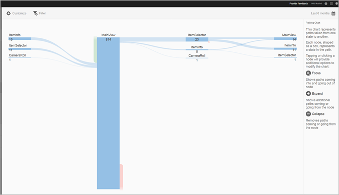

# Visa rapport om sökvägar {#view-paths}

I **[!UICONTROL View Paths]** rapporten, som baseras på sökvägsanalys, visas ett målningsdiagram som representerar de sökvägar som har tagits mellan lägena i appen.

>[!TIP]
>
>Rapporterna **[!UICONTROL View Paths]** och **[!UICONTROL View Action]** är likartade eftersom båda är pautrapporter. I rapporten kan du se hur användare navigerar i appen från en skärm till nästa. **[!UICONTROL View Paths]** I **[!UICONTROL View Actions]** rapporten visas den åtgärdssekvens (händelser, t.ex. klickningar, markeringar, storleksändring och så vidare) som användare utför i din app. Du kan använda en trattrapport för att kombinera navigering och åtgärder i en rapport. Mer information finns i [Tratt](/help/using/usage/reports-funnel.md).

Varje nod, i form av en ruta, representerar ett läge i användarnas sökvägar via en app. I bilden ovan representerar till exempel den översta noden antalet användare som startade programmet och navigerade till huvudvyn.

När du klickar på en nod för att ange ytterligare alternativ för att ändra diagrammet, visas ytterligare alternativ som **[!UICONTROL Focus]** eller **[!UICONTROL Expand]** . Om du till exempel klickar på **[!UICONTROL MainView]** läget i den övre noden visas ikonerna **[!UICONTROL Focus]** och **[!UICONTROL Expand]** ikonerna.

Om du vill expandera vyn klickar du på **[!UICONTROL +]** ikonen för att visa de ytterligare sökvägarna som kommer in i eller går från noden. I bilden nedan startar läge 1 appen, läge 2 visar programmets huvudsida och läge 3 innehåller följande sökvägar som användarna har tagit:

* Navigera till kamerarullen
* navigera till objektväljaren
* navigera till kameran
* navigera till objektinformationssidan

Klicka på  för att isolera noden och visa sökvägarna som kommer in i och går ut ur den markerade noden. I bilden nedan gick följande sökvägar före användare som visade programmets huvudvy:

* objektinformation
* objektväljare
* Kamerarulle
* Kamera

Du kan fokusera eller utöka flera noder för att få en detaljerad vy över de sökvägar som användarna tar i appen. Exempel:

Du kan konfigurera följande alternativ för den här rapporten:

* **[!UICONTROL Time Period]**
Klicka på **[!UICONTROL Calendar]** ikonen för att välja en egen punkt eller för att välja en förinställd tidsperiod i listrutan.
* **[!UICONTROL Customize]**
Anpassa era rapporter genom att ändra **[!UICONTROL Show By]** alternativen, lägga till mätvärden och filter, lägga till ytterligare serier (mätvärden) med mera. Mer information finns i [Anpassa rapporter](/help/using/usage/reports-customize/reports-customize.md).
* **[!UICONTROL Filter]**
Klicka **[!UICONTROL Filter]** för att skapa ett filter som spänner över olika rapporter för att se hur ett segment fungerar i alla mobilrapporter. Med ett klisterlappsfilter kan du definiera ett filter som ska användas på alla rapporter som inte är avsedda för målning. Mer information finns i [Lägg till anteckningsfilter](/help/using/usage/reports-customize/t-sticky-filter.md).
* **[!UICONTROL Download]**
Klicka **[!UICONTROL PDF]** eller **[!UICONTROL CSV]** för att ladda ned eller öppna dokument och dela med användare som inte har tillgång till Mobile Services eller för att använda filen i presentationer.