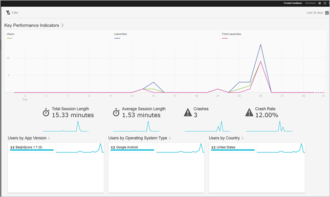

# Översiktsrapport{#overview}

Översiktsrapporten innehåller en ögonblicksbild av dina nyckeltal.

Här är ett exempel på den här rapporten:

Du kan ändra datumintervallet för rapporten genom att klicka på kalenderikonen överst till höger. Du kan också skapa ett klisterfilter som spänner över olika rapporter för att se hur ett segment fungerar i alla mobila rapporter. Mer information om hur du skapar ett klisterfilter finns i [Lägg till klisterfilter](/help/using/usage/reports-customize/t-sticky-filter.md).

>[!TIP]
>
>Du konfigurerar nyckelmåtten för den här rapporten när du skapar programmet. Mer information finns i [Konfigurera din app](/help/using/c-manage-app-settings/c-mob-confg-app/c-mob-confg-app.md).
