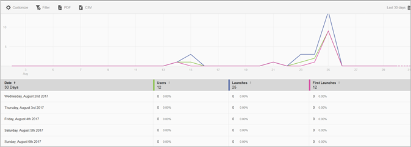

# Rapport över användare och sessioner{#users-and-sessions}

Rapporten Användare och sessioner visar mätvärden för unika besökare under den valda tidsramen.

Du kan konfigurera följande alternativ för den här rapporten:

* **[!UICONTROL Time Period]**

   Klicka på **[!UICONTROL Calendar]** ikonen för att välja en egen punkt eller för att välja en förinställd tidsperiod i listrutan.

* **[!UICONTROL Customize]**

   Anpassa era rapporter genom att ändra **[!UICONTROL Show By]** alternativen, lägga till mätvärden och filter, lägga till ytterligare serier (mätvärden) med mera. Mer information finns i [Anpassa rapporter](/help/using/usage/reports-customize/t-reports-customize.md).

* **[!UICONTROL Filter]**

   Klicka **[!UICONTROL Filter]** för att skapa ett filter som spänner över olika rapporter för att se hur ett segment fungerar i alla mobilrapporter. Med ett klisterlappsfilter kan du definiera ett filter som ska användas på alla rapporter som inte är avsedda för målning. Mer information finns i [Lägga till klisterfilter](/help/using/usage/reports-customize/t-sticky-filter.md).

* **[!UICONTROL Download]**

   Klicka **[!UICONTROL PDF]** eller **[!UICONTROL CSV]** för att ladda ned eller öppna dokument och dela med användare som inte har tillgång till Mobile Services eller för att använda filen i presentationer.